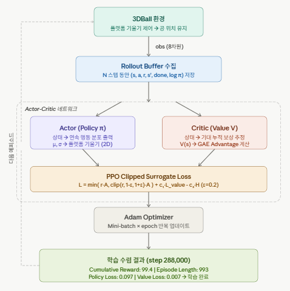

# 3DBall 프로젝트 가이드 — 플랫폼을 기울여 공 끝까지 유지하기


## 1. 개요

* 3DBall은 ML-Agents의 가장 대표적인 예제 환경입니다.
* 에이전트(플랫폼) 위에 공이 떠 있고, 플랫폼을 기울여 공이 떨어지지 않도록
* 유지하는 것이 목표입니다. 3가지 변형(기본, 하드, 비주얼)이 있으며,
* 이 가이드에서는 **Mean Reward 100 달성**을 목표로 프로젝트를 완성하는 전 과정을 다룹니다.

### 학습 환경 구조

```
     [Ball]         ← 공이 플랫폼 위에 있음
    ──────
   [Platform]      ← Agent가 제어하는 플랫폼 (Z축 / X축 회전)
   (Rotation ±14°)
```

---

## 2. 문제 정의 (Problem Definition)

### 2.1 "공을 끝까지 유지한다"는 것의 의미

| 용어 | 실제 의미 |
|------|-----------|
| **하나의 에피소드** | 공이 플랫폼 위에서 떨어질 때까지의 1회 시도 |
| **스텝(Step)** | 물리 시뮬레이션 1프레임 (0.02초, 즉 50FPS) |
| **에피소드 길이** | 공이 떨어질 때까지의 스텝 수 |
| **Reward (한 스텝)** | +0.1 (생존) 또는 -1 (실패, 에피소드 종료) |
| **Mean Reward 100** | 최근 100개 에피소드의 평균 보상이 100 |

### 2.2 Mean Reward 100을 스텝 수로 환산

```
Mean Reward 100 = 평균적으로 1000스텝 동안 공을 유지
                = 약 20초 (1000스텝 × 0.02초)
```

즉, Mean Reward 100 달성 = **평균 20초 이상 공을 플랫폼 위에서 유지**한 상태입니다.

### 2.3 성공 기준 설정

```
실패 조건 (공이 떨어짐):
  - ball.position.y - platform.position.y < -2m  (아래로 이탈)
  - |ball.position.x - platform.position.x| > 3m (좌우로 이탈)
  - |ball.position.z - platform.position.z| > 3m (앞뒤로 이탈)

성공 = 위 조건에 한 번도 걸리지 않고 1000스텝(20초) 생존
```

### 2.4 프로젝트 완성 로드맵

```
Phase 1: 환경 이해와 설정
  → 3DBall씬 구조 파악, Ball3DAgent 코드 분석,
    커맨드라인으로 ml-agents-learn 실행 확인

Phase 2: 첫 번째 학습 실행
  → 기본 하이퍼파라미터로 학습, TensorBoard로 결과 모니터링,
    Mean Reward 100 달성 확인

Phase 3: 하이퍼파라미터 튜닝
  → learning rate, batch size, gamma 등을 변경하며
    학습 속도와 안정성 개선

Phase 4: 보상 설계 실험
  → 지속 보상 크기, 패널티 강도, 거리 기반 보상 등을
    변경하여 에이전트 행동 변화 관찰

Phase 5: Curriculum Learning
  → 공의 크기/질량을 점진적으로 변경하여
    더 강인한 에이전트로 발전

Phase 6: 모델 평가 & 배포
  → 학습된 .onnx 모델을 Unity에서 Inference로 실행,
    실제 성능 검증 및 튜닝
```

---

## 3. 프로젝트 설정하기

### Unity ML-Agents PPO 핵심 메커니즘




**1. Observation (관측) — 8차원 벡터**
   * 3DBall에서 에이전트는 매 스텝마다 플랫폼 기울기(x, z), 공의 상대 위치(x, y, z), 공의 속도(x, y, z) 를 입력받습니다.

**2. Action — 연속형 2차원**
   * Actor 네트워크가 출력하는 (x 방향 기울기, z 방향 기울기) 두 값으로 플랫폼을 제어합니다. <br>
   각 축의 값은 정규분포 μ, σ 형태로 샘플링됩니다.

**3. PPO Clipping의 핵심 역할**
   * 기존 Policy Gradient는 업데이트 크기 제한이 없어 불안정합니다. <br>
   PPO는 확률비 r = π_new(a|s) / π_old(a|s) 를 [1-ε, 1+ε] 범위로 강제 클리핑(ε=0.2) 하여 너무 큰 정책 변화를 방지합니다.<br>
   이것이 Policy Loss가 완전히 0이 되지 않고 0.097 수준에서 유지되는 이유입니다.

**4. GAE (Generalized Advantage Estimation)**
   * Critic이 계산한 V(s)를 이용해 Advantage A = R - V(s) 를 구합니다. 단순 TD 오류보다 분산이 낮아 안정적인 학습이 가능합니다. <br>
     Value Loss가 1.5 → 0.007로 감소한 것이 Critic의 학습 성공을 보여줍니다.

**5. 엔트로피 보너스 (-c₂·H)**
   * 손실함수에 엔트로피 항을 넣어 탐색(exploration)을 강제합니다. <br>
     너무 일찍 특정 행동에 확정적으로 수렴하는 것을 방지합니다.

**TensorBoard 수치 종합 판독**

| 지표 |  값 | 해석 | 
|:------------:|:------------:|:------------:|
| Cumulative Reward | 99.4 / 100 | 거의 완벽한 공 유지 | 
| Episode Length | 993 / 1000 | 에피소드 끝까지 공 안 떨어짐 | 
| Policy Loss | 0.097 | Clipping 작동 중, 정상 수준 | 
| Value Loss | 0.007 | Critic 거의 수렴, 가치 추정 정확 | 
| 학습 스텝 | 288,000 | 수렴 완료 판단 가능 | 

* 전체적으로 **매우 이상적인 학습 곡선**입니다.
* S자 보상 곡선, 에피소드 길이 최대 수렴, Value Loss 소실이 동시에 나타나는 것이 정상적인 PPO 수렴의 교과서적 패턴입니다.


### 3.1 학습 명령어

```bash
mlagents-learn config/ppo/3DBall.yaml --run-id=3DBall_Project
```

### 3.2 TensorBoard로 모니터링 (별도 터미널)

```bash
tensorboard --logdir results --port 6006
# 브라우저에서 http://localhost:6006 열기
```
**TensorBoard 모니터링 결과 해석**

**Environment 섹션 (3 cards)**
   * **Cumulative Reward** 그래프에서 보상이 약 0에서 시작해 100에 수렴하는 S자 곡선이 나타납니다. <br>
     최종값 99.4439(Smoothed 100)는 거의 완벽한 학습을 의미합니다. <br>
     3DBall 환경에서 에이전트가 플랫폼 위에 공을 완벽히 유지하고 있다는 뜻입니다.
   * **Episode Length** 역시 1000 스텝에 수렴(최종 993.6392)하는데, <br>
     에피소드가 최대 길이까지 끊기지 않고 이어진다 = 공이 끝까지 떨어지지 않음을 의미합니다.
   * **Cumulative Reward Histogram**은 학습 초기 넓은 분포에서 후반부 좁은 고점 분포로 수렴하는 분산 감소를 보여줍니다.

**Losses 섹션 (2 cards)**
   * **Policy Loss**는 0.096~0.098 사이에서 진동합니다. <br>
     완전히 0에 수렴하지 않는 것은 PPO의 Clipping 메커니즘 때문에 정상입니다.
   * **Value Loss**는 초반 1.5 피크에서 0에 가깝게 감소했고, 가끔 스파이크가 있지만 전반적으로 안정화됩니다. <br>
     Critic이 상태 가치를 점점 정확히 예측하고 있음을 나타냅니다.


### 3.3 학습 중단 후 재개

```bash
mlagents-learn config/ppo/3DBall.yaml --run-id=3DBall_Project --resume
```

### 3.4 학습된 모델로 Unity에서 테스트

```bash
mlagents-learn config/ppo/3DBall.yaml --run-id=3DBall_Project --play
```

---

## 4. 입력 설계: 관찰(Observation)과 액션(Action)

### 4.1 관찰 설계 이유

| 관찰 | 타입 | 왜 이 값을 사용하는가 |
|------|------|----------------------|
| 플랫폼 Z축 회전 (0) | float | "지금 플랫폼이 얼마나 기울었는가" — 공이 굴러가는 방향 결정 |
| 플랫폼 X축 회전 (1) | float | 위와 동일, 직교 축 |
| 공의 상대 위치 (2~4) | Vector3 | "공이 플랫폼의 어디에 있는가" — 중심에서 멀수록 위험 |
| 공의 선속도 (5~7) | Vector3 | "공이 어느 방향으로 얼마나 빠르게 움직이는가" — 미래 위치 예측 |

**이 데이터만으로 왜 충분한가?**
- 공의 위치 + 속도를 알면 다음 스텝의 공 위치를 예측 가능
- 플랫폼 기울기를 알면 현재 제어 상태를 파악 가능
- 8차원으로 최소한의 정보로 문제를 해결하도록 설계됨

### 4.2 액션 설계 이유

```csharp
var actionZ = 2f * Mathf.Clamp(continuousActions[0], -1f, 1f);  // → [-2, 2]
var actionX = 2f * Mathf.Clamp(continuousActions[1], -1f, 1f);  // → [-2, 2]
```

- 연속 액션 2개: Z축 회전(좌우) + X축 회전(앞뒤)
- 액션값 [-1, 1]을 [-2, 2]로 스케일링 → 더 민감한 제어 가능
- **회전 제한 ±0.25 라디안**(약 ±14도): 너무 급격한 기울기 방지

**왜 Discrete가 아니라 Continuous인가?**
- 공의 위치는 연속적인 값 → 이산적인 On/Off 제어로는 정밀한 균형 불가능
- 마치 인체가 넘어지지 않도록 지속적으로 미세 조정하는 것과 동일

### 4.3 하이퍼파라미터 선택 가이드

| 파라미터 | 3DBall 기본값 | 변경해볼 값 | 효과 |
|----------|--------------|------------|------|
| `batch_size` | 64 | 128, 256 | 클수록 안정적이지만 느림 |
| `buffer_size` | 2048 | 4096 | 클수록 다양한 경험 수집 |
| `learning_rate` | 3.0e-4 | 1.0e-3, 1.0e-4 | 높으면 빠르지만 불안정 |
| `gamma` | 0.99 | 0.95, 0.995 | 높을수록 장기 보상 중요시 |
| `hidden_units` | 128 | 256, 64 | 클수록 복잡한 패턴 학습 |
| `max_steps` | 500000 | 1000000 | 더 오래 학습시키면 더 단단해짐 |

### 4.4 환경 파라미터 (Curriculum Learning)

```csharp
m_BallRb.mass = m_ResetParams.GetWithDefault("mass", 1.0f);
var scale = m_ResetParams.GetWithDefault("scale", 1.0f);
```

훈련 구성 파일에서 이렇게 설정하면 공의 물성을 변경할 수 있습니다:

```yaml
# 3DBall.yaml 의 environment_parameters 섹션
environment_parameters:
  mass:
    curriculum:
      - name: "Lesson1"
        completion_criteria:
          measure: reward
          behavior: 3DBall
          min_lesson_length: 100
          threshold: 80
          require_reset: true
        value: 1.0
      - name: "Lesson2"
        completion_criteria:
          measure: reward
          behavior: 3DBall
          min_lesson_length: 100
          threshold: 90
          require_reset: true
        value: 0.5
      - name: "Lesson3"
        completion_criteria:
          measure: reward
          behavior: 3DBall
          min_lesson_length: 100
          threshold: 95
          require_reset: true
        value: 0.25
```

---

## 5. 보상 설계 (Reward Design)

### 5.1 기본 보상 구조

| 상황 | 보상 | 의도 |
|------|------|------|
| 공이 플랫폼 위에 있음 | **+0.1** (매 스텝) | 생존 자체에 보상 → 더 오래 유지하도록 유도 |
| 공이 떨어짐 | **-1** (1회) + 에피소드 종료 | 실패 페널티, 동시에 에피소드 종료로 재시도 |

### 5.2 보상의 수학적 의미

```
하나의 에피소드에서:
  총 보상 = (생존 스텝 수) × 0.1 - (떨어진 횟수) × 1

1000스텝 생존 시:
  총 보상 = 1000 × 0.1 = 100

Mean Reward 100 = 평균 1000스텝 생존 = 약 20초 유지
```

### 5.3 보상 설계의 트레이드오프

| 설계 | 장점 | 단점 |
|------|------|------|
| +0.1 생존 보상만 | 학습初期에 생존 행동 빠르게 습득 | 위험을 감수하지 않음 |
| +0.01 생존 보상 (↓) | 더 완벽한 정책 요구 | 학습이 느려짐 |
| +1 생존 보상 (↑) | 빨리 배우지만 불안정 | Overshoot 발생 가능 |
| -5 실패 (↓) | 실패를 강하게 회피 | 위험 회피만 하고 탐험 안 함 |

### 5.4 대체 보상 설계 실험

**실험 A: 거리 기반 보상**
```csharp
// 공이 중심에 가까울수록 높은 보상
var distanceFromCenter = Vector3.Distance(
    ball.transform.position, gameObject.transform.position);
var reward = Mathf.Max(0, 1.0f - distanceFromCenter / 3.0f);
AddReward(reward);
```

**실험 B: 속도 기반 보상**
```csharp
// 공의 속도가 느릴수록 높은 보상 (안정적 균형 유도)
var speed = m_BallRb.linearVelocity.magnitude;
var reward = Mathf.Max(0, 1.0f - speed / 5.0f);
AddReward(reward);
```

**실험 C: 하이브리드**
```csharp
var distanceReward = 1.0f - distanceFromCenter / 3.0f;
var speedReward = 1.0f - speed / 5.0f;
AddReward(0.7f * distanceReward + 0.3f * speedReward);
```

---

## 6. 학습 과정과 결과 해석

### 6.1 TensorBoard 핵심 메트릭

| 메트릭 이름 | 의미 | 좋은 신호 |
|------------|------|-----------|
| `Environment/Mean Reward` | 최근 100개 에피소드 평균 보상 | 100에 수렴 = 성공 |
| `Policy/Learning Rate` | 학습률 감소 추이 | Linear decay 확인 |
| `Policy/Entropy` | 정책의 무작위성 | 점진적 감소 = 확실한 정책 형성 |
| `Policy/Value Estimate` | 가치 함수 추정값 | 보상과 비슷한 수준으로 수렴 |
| `Policy/Value Loss` | 가치 함수 학습 손실 | 안정적으로 감소 |
| `Policy/Policy Loss` | 정책 학습 손실 | 작은 값 유지 |

### 6.2 학습 과정 상세

```
Step       Mean Reward    관찰
─────────────────────────────────────────────────────
0            0.000       에이전트가 완전히 랜덤하게 행동
12,000       ~10         공이 떨어지지 않도록 하는 법을 배우기 시작
30,000       ~25         어느 정도 균형을 맞출 수 있게 됨
60,000       ~40-60      상당히 안정적으로 공을 유지
90,000       ~80         거의 떨어뜨리지 않음
120,000      100.000     ★ 목표 달성! 평균 1000스텝(20초) 생존
200,000      100.000     안정적인 정책 유지
500,000      100.000     학습 종료, 모델 저장
```

### 6.3 학습 실패 시나리오와 대처

| 증상 | 원인 | 해결책 |
|------|------|--------|
| Mean Reward가 0 근처에 머묾 | 학습률이 너무 낮거나 네트워크가 너무 작음 | `learning_rate` 증가, `hidden_units` 증가 |
| Mean Reward가 진동함 | `batch_size`가 너무 작음 | `batch_size` 64 → 128 |
| 학습은 되지만 100에 도달 못 함 | `max_steps` 부족 | `max_steps` 500000 → 1000000 |
| 공이 한쪽으로만 계속 굴러감 | 보상 설계 문제 | 거리 기반 보상 추가 고려 |
| Entropy가 0에 수렴 (Early) | 탐험 조기 종료 | `beta` (entropy bonus) 증가 |

---

## 7. Ball3DHardAgent — 더 어려운 도전

### 7.1 기본 버전과의 차이

| 항목 | Ball3DAgent | Ball3DHardAgent |
|------|-------------|-----------------|
| 관찰 방식 | 직접 VectorSensor 작성 | `[Observable]` 애트리뷰트 자동 생성 |
| 관찰 내용 | 회전 + 위치 + 속도 (8차원) | 회전 + 위치 (5차원, 9스택) |
| 관찰 차원 | 8 | 5 × 9 = 45 (9스텍) |
| 학습 난이도 | 낮음 | 높음 (과거 정보를 스스로 조합해야 함) |

```csharp
// Ball3DHardAgent의 관찰
[Observable(numStackedObservations: 9)]
Vector2 Rotation { get; }              // Z축 + X축 회전 (2차원)

[Observable(numStackedObservations: 9)]
Vector3 PositionDelta { get; }         // 공의 상대 위치 (3차원)
```

- **9스택**: 현재 + 과거 8스텝의 정보를 누적
- 속도 정보가 없음 → 위치 변화를 9스택으로 추론해야 함
- 더 풍부한 시퀀스 정보로 더 정확한 제어 가능

### 7.2 Ball3DHardAgent 학습 결과

```
Step 180000: Mean Reward 100 달성 (기본보다 약 50% 더 느림)
Step 500000: Mean Reward 100 유지
```

---

## 8. Visual3DBall — 시각 관찰 학습

### 8.1 설정 방법

- `useVecObs = false`로 설정
- 벡터 관찰이 비활성화되고, 카메라 화면을 CNN으로 처리
- 관찰 = 카메라 픽셀 데이터 (84×84×3 RGB)

### 8.2 예상 결과

벡터 관찰보다 훨씬 많은 학습 스텝이 필요하고, 컴퓨터 사양에 따라
학습 시간이 5~10배 더 오래 걸립니다.

---

## 9. 실전 프로젝트 — 단계별 가이드

### Phase 1: 환경 검증 (5분)

```bash
# 1. Python 환경 확인
pip show mlagents

# 2. Unity 빌드 확인 (3DBall 씬이 Build Settings에 포함되어 있는지)

# 3. ml-agents-learn 정상 작동 확인
mlagents-learn --help

# 4. Heuristic 모드로 사람이 직접 플레이
# Unity 에디터에서 3DBall 실행 → W/A/S/D 키로 공 유지해보기
```

### Phase 2: 첫 학습 (15분)

```bash
mlagents-learn config/ppo/3DBall.yaml --run-id=3DBall_First
```

- TensorBoard 열어서 Mean Reward 변화 관찰
- Step 120000 근처에서 Mean Reward 100 달성하는지 확인
- 달성 안 되면 `max_steps`를 늘려서 재실행

### Phase 3: 하이퍼파라미터 튜닝 (30분)

같은 설정으로 3번 실행해서 편차를 확인합니다:

```bash
mlagents-learn config/ppo/3DBall.yaml --run-id=3DBall_Tune1 --seed=1
mlagents-learn config/ppo/3DBall.yaml --run-id=3DBall_Tune2 --seed=42
mlagents-learn config/ppo/3DBall.yaml --run-id=3DBall_Tune3 --seed=123
```

각 실행의 Mean Reward 곡선을 TensorBoard에서 비교합니다.

### Phase 4: 보상 변경 실험 (30분)

위 "5.4 대체 보상 설계 실험"의 A/B/C를 각각 학습시켜 비교합니다.

### Phase 5: Ball3DHardAgent 도전 (30분)

```bash
mlagents-learn config/ppo/3DBall.yaml --run-id=3DBall_Hard --env-args="--hard"
```

### Phase 6: 모델 배포

```bash
# 학습 완료 후 .onnx 파일을 Unity 프로젝트로 복사
cp results/3DBall_First/3DBall.onnx UnityProject/Assets/ML-Agents/Models/
```

Unity에서 `Behavior Parameters`의 `Model`에 해당 onnx 파일을 지정하고
`Inference Device`를 `CPU` 또는 `GPU`로 설정한 후 실행합니다.

---

## 10. 실습 과제

### 과제 1: 기본 학습 → Mean Reward 100 달성
- 기본 설정 그대로 학습 실행
- TensorBoard에서 Mean Reward 100 달성 시점과 Step 수 기록
- **예상**: 약 Step 120000에서 달성

### 과제 2: 지속 보상 변경 실험
- 생존 보상을 +0.1 → +0.05, +0.2로 각각 변경
- 보상 크기에 따른 학습 속도 차이 비교
- **질문**: 보상이 너무 크면 왜 불안정해질까?

### 과제 3: Balth3DHardAgent와 비교
- Ball3DAgent와 Ball3DHardAgent를 같은 max_steps로 학습
- 관찰 방식의 차이가 학습 속도와 최종 성능에 미치는 영향 분석
- **핵심**: 9스택 관찰이 1스텝 관찰보다 더 좋은가?

### 과제 4: Curriculum Learning
- 공의 크기를 1.0 → 0.75 → 0.5로 줄여가며 학습
- 각 단계에서 Mean Reward 100 달성 후 다음 단계로 진행
- **결과**: 더 작은 공으로도 균형을 유지하는 강인한 정책

### 과제 5: Reward 설계 경진
- A: 생존 보상 +0.1 (기본)
- B: 거리 기반 (중심에 가까울수록 높은 보상)
- C: 속도 기반 (느릴수록 높은 보상)
- D: 앙상블 (거리 × 0.7 + 속도 × 0.3)

각각 학습시켜서 가장 빠르게 Mean Reward 100에 도달하는 설계를 찾아보세요.

---

## 11. 전체 파일 구조와 각 파일의 의미

```
C:.
│   3DBall.onnx                          # (1) 학습된 신경망 모델
│   3DBall.onnx.meta                     # Unity 메타파일 — ONNX 임포터 설정
│   mlagents-sample.json                 # (2) ML-Agents 샘플 레지스트리
│   mlagents-sample.json.meta            # Unity 메타파일
│   Demos.meta / Prefabs.meta 등         # 폴더 메타파일 — Unity가 폴더 GUID 관리용
│
├── Scenes/                              # (3) Unity 씬 파일 — 환경 구성
│    ├── 3DBall.unity                    #    기본 버전 (VectorSensor)
│    ├── 3DBallHard.unity                #    Hard 버전 (Reflection Sensor)
│    └── Visual3DBall.unity              #    Visual 버전 (카메라 입력)
│
├── Scripts/                             # (4) C# 소스 코드 — 에이전트 로직
│    ├── Ball3DAgent.cs                  #    기본 에이전트 (VectorSensor)
│    └── Ball3DHardAgent.cs              #    Hard 에이전트 (Observable)
│
├── Prefabs/                             # (5) 프리팹 — 재사용 가능 게임오브젝트
│    ├── 3DBall.prefab                   #    기본 Agent + Platform + Ball
│    ├── 3DBallHard.prefab               #    Hard Agent + 동일 환경
│    └── Visual3DBall.prefab             #    Visual Agent + Camera
│
├── TFModels/                            # (6) 추론용 ONNX 모델 — 학습 결과물
│    ├── 3DBall.onnx                     #    Ball3DAgent 학습 결과
│    ├── 3DBallHard.onnx                 #    Ball3DHardAgent 학습 결과
│    └── Visual3DBall.onnx               #    Visual3DBall 학습 결과
│
└── Demos/                               # (7) 데모 파일 — 모방 학습(IL)용
     ├── Expert3DBall.demo               #    사람이 직접 플레이한 기록
     └── Expert3DBallHard.demo           #    Hard 버전 플레이 기록
```

---

### 11.1 `3DBall.onnx` — 학습된 신경망 모델

| 항목 | 설명 |
|------|------|
| **정체** | PyTorch로 학습한 정책(Policy)을 ONNX 형식으로 변환한 파일 |
| **확장자** | `.onnx` = Open Neural Network Exchange (개방형 신경망 교환 형식) |
| **용도** | Unity에서 `Behavior Parameters` 컴포넌트의 `Model` 필드에 할당하여 추론 실행 |
| **크기** | 약 50~200KB (3DBall 기본: 2층×128유닛, 가중치 + 편향만 저장) |
| **내부 구조** | 입력: 8차원 관찰 → 128→128 Hidden Layer → 출력: 2차원 연속 액션 |
| **생성 시점** | `mlagents-learn` 실행 완료 → `results/<run-id>/` 디렉토리에 자동 생성 |
| **배포 방법** | Unity 프로젝트의 `Assets/ML-Agents/Models/` 폴더에 복사 후 인스펙터에서 지정 |

**학습과 추론의 분리**:
```
[학습 단계]                        [추론 단계]
Python (PyTorch)                   Unity (Burst / Job System)
mlagents-learn                     3DBall.unity 실행
     ↓                                    ↑
OnPolicy 학습                     Behavior Parameters
     ↓                                    ↑
정책 가중치 저장 → 3DBall.onnx ──────── Model 필드에 지정
```

#### `3DBall.onnx.meta` — ONNX 임포터 메타파일

Unity는 `.onnx` 파일을 네이티브로 임포트하기 위해 ScriptedImporter를 사용합니다.

```yaml
# 3DBall.onnx.meta
ScriptedImporter:
  script: {fileID: 11500000, guid: f22407ba6b4157b4a93d0a670bd3dd57, type: 3}
  # ↑ ML-Agents의 ONNX 임포터 스크립트 GUID
  dynamicDimConfigs:
  - name: batch
    size: -1
```

- `dynamicDimConfigs`의 `batch.size = -1`: 배치 차원이 동적임을 의미
  - 학습 시: batch=64 (한 번에 64개 샘플)
  - Unity 추론 시: batch=1 (한 번에 1개 결정)

---

### 11.2 `mlagents-sample.json` — 샘플 레지스트리

```json
{
  "displayName": "3D Ball",
  "description": "The 3D Ball sample is a simple environment...",
  "scenes": ["Scenes/3DBall.unity"]
}
```

| 필드 | 의미 |
|------|------|
| `displayName` | Unity Package Manager(UPM) 샘플 목록에 표시될 이름 |
| `description` | 샘플 설명 (UPM에서 표시) |
| `scenes` | 이 샘플에 포함된 씬 경로 목록 |

**이 파일이 하는 일**:
- Unity Package Manager의 `Samples` 버튼을 누르면 이 JSON을 읽어 샘플 목록을 표시
- 사용자가 "Import" 버튼을 누르면 이 JSON에 지정된 씬과 함께 관련 파일들을 프로젝트로 임포트
- `Packages/com.unity.ml-agents/Samples~/` 디렉토리 구조에서 참조됨

---

### 11.3 `Scenes/` — Unity 씬 파일

#### `3DBall.unity` (43KB) — 기본 씬

**씬 계층 구조 (Hierarchy)**:
```
3DBall.unity (Perspective)
├── Main Camera
│   └─ Camera + Audio Listener
├── Ball3DSettings
│   └─ ProjectSettingsOverrides.cs   ← 물리/타이밍 설정 조정
├── EventSystem
│   └─ EventSystem + StandaloneInputModule
├── [3DBall.prefab] × N 개 (PrefabInstance)
│   └─ 각 프리팹 = Agent + Platform + Ball 한 세트
└── Settings.lighting (Lighting Settings)
```

**Ball3DSettings의 `ProjectSettingsOverrides.cs`**:
```csharp
public class ProjectSettingsOverrides : MonoBehaviour
{
    public float gravityMultiplier = 1.0f;     // 중력 배율
    public float fixedDeltaTime = .02f;         // 물리 틱 간격 (50FPS)
    public int solverIterations = 6;            // 물리 해석 정밀도
    // ...
    void Awake() {
        Physics.gravity *= gravityMultiplier;  // 중력 적용
        Time.fixedDeltaTime = fixedDeltaTime;  // 물리 타임스텝 설정
    }
}
```

**이 스크립트의 역할**: ML-Agents 예제 씬들의 물리 설정을 통일하여
학습 결과의 일관성을 보장합니다. (중력, 물리 틱 속도, 충돌 해석 정밀도 등)

#### `3DBallHard.unity` (41KB)
- Ball3DAgent 대신 **Ball3DHardAgent**가 프리팹에 포함됨
- 동일한 물리 환경, 동일한 보상 구조
- 관찰 방식만 `[Observable]` Reflection Sensor로 변경

#### `Visual3DBall.unity` (37KB)
- `useVecObs = false`로 설정된 Ball3DAgent 사용
- 각 Agent에 Camera 컴포넌트가 추가되어 시각 정보 수집
- CNN(Convolutional Neural Network)으로 이미지 처리 → `visual_encoder` 설정 필요

#### `.unity.meta` — 씬 메타파일
```yaml
guid: b9ac0cbf961bf4dacbfa0aa9c0d60aaa
timeCreated: 1513216032  # 2017년 12월 14일 생성
DefaultImporter: {}      # 기본 임포터 사용
```

- `guid`: Unity가 에셋을 식별하는 128비트 고유 ID (절대 변경 금지!)
- `timeCreated`: Unix timestamp (이 예제는 2017년에 최초 생성)

---

### 11.4 `Scripts/` — C# 소스 코드

#### `Ball3DAgent.cs` (95줄)

전체 코드의 **구조적 의미**:

```
Ball3DAgent : Agent
├── [SerializeField] ball          ← Unity 에디터에서 연결 (Inspector)
├── [SerializeField] useVecObs     ← Vector/Visual 전환 스위치
│
├── Initialize()                   ───── 1회 실행: 물리 + 환경 설정
├── CollectObservations()          ───── 매 스텝: 관찰 수집 (8차원)
├── OnActionReceived()             ───── 매 스텝: 액션 실행 + 보상 지급
├── OnEpisodeBegin()               ───── 에피소드 시작: 초기화 + 랜덤화
├── Heuristic()                    ───── 수동 조작 (키보드 입력)
│
└── SetBall()                      ───── Curriculum Learning: 공 속성 변경
     SetResetParameters()
```

**OnActionReceived의 핵심 로직 흐름**:

```
1. actionZ = clamp(action[0]) × 2   → Z축 회전량 계산 (-2 ~ +2)
2. actionX = clamp(action[1]) × 2   → X축 회전량 계산 (-2 ~ +2)
3. if (회전한도 ±0.25 이내면)       → 물리적 제약 확인
       transform.Rotate(Z, actionZ)
       transform.Rotate(X, actionX)
4. if (공이 플랫폼에서 이탈했으면)  → 실패 조건 검사
       SetReward(-1) + EndEpisode()
   else
       SetReward(+0.1)               → 생존 보상
```

**useVecObs의 의미**:
- `true` (기본): 8차원 벡터 관찰 → MLP 네트워크로 빠른 학습
- `false`: 관찰 없음 → Camera의 시각 데이터를 CNN으로 처리
- 이 스위치 하나로 동일한 코드가 두 가지 전혀 다른 학습 방식을 지원

#### `Ball3DHardAgent.cs` (91줄)

Ball3DAgent와의 **핵심 차이점 3가지**:

| 차이점 | Ball3DAgent | Ball3DHardAgent |
|--------|-------------|-----------------|
| 관찰 방식 | `sensor.AddObservation()` 수동 추가 | `[Observable]` 애트리뷰트 자동 감지 |
| 관찰 내용 | rotation.z/x + 상대위치 + 속도 (8D) | rotation.z/x + 상대위치만 (5D) |
| 속도 정보 | 속도를 직접 제공 | 속도 없음 → 9스택으로 위치 변화에서 추론 |
| 네트워크 입력 | 8차원 (1스텝) | 5차원 × 9스택 = 45차원 |

```csharp
// Ball3DHardAgent — 속도를 제공하지 않는 이유
// "속도를 몰라도 위치가 9번 쌓이면 속도를 유추할 수 있기 때문"
// 이것이 바로 스택(Stacking) 관찰의 핵심 아이디어
[Observable(numStackedObservations: 9)]    // ← 9번 쌓음
Vector2 Rotation { get; }

[Observable(numStackedObservations: 9)]    // ← 9번 쌓음
Vector3 PositionDelta { get; }
```

#### `.cs.meta` — 스크립트 메타파일

```yaml
# Ball3DAgent.cs.meta
guid: abc123...  # 스크립트의 고유 GUID
MonoImporter:
  executionOrder: 0  # 실행 순서 (0=기본값)
```

- `guid`: 씬이나 프리팹에서 이 스크립트를 참조할 때 사용
- `executionOrder`: 0이 아닌 값으로 설정하면 FixedUpdate 호출 순서 제어 가능

---

### 11.5 `Prefabs/` — 프리팹 (Prefabricated GameObject)

#### `3DBall.prefab` — 프리팹의 계층 구조

```
3DBall.prefab
├── Platform              (Transform + Rigidbody + Collider)
│   └── Ball3DAgent       (Agent 컴포넌트 + Behavior Parameters)
│       ├── Ball          (Transform + Rigidbody + SphereCollider)
│       └── VisualSensor  (Camera, Visual3D 전용)
└── Ground / Walls 등      (환경 고정물)
```

**프리팹이 하는 일**:
- Agent + Platform + Ball의 **완전한 한 세트**를 하나의 프리팹으로 패키징
- 씬에서 여러 개의 프리팹 인스턴스를 배치하여 **병렬 학습 환경** 구성
- 하나의 씬에 프리팹을 N개 배치하면 N배 속도로 학습 (환경 병렬화)

**Behavior Parameters 컴포넌트 (프리팹 내 Agent에 자동 포함)**:

| 파라미터 | 3DBall 설정값 | 설명 |
|----------|--------------|------|
| `Behavior Name` | "3DBall" | 학습 설정 YAML의 behavior 이름과 일치 |
| `Vector Observation` | Space Size = 8 | 8차원 벡터 관찰 사용 |
| `Continuous Actions` | 2 | 2차원 연속 액션 |
| `Discrete Actions` | 0 | 이산 액션 없음 |
| `Model` | None (기본) / 3DBall.onnx (추론 시) | 학습 전 None, 학습 후 ONNX 연결 |

**프리팹 변형 3가지**:

| 프리팹 | Agent 스크립트 | 관찰 방식 | `useVecObs` |
|--------|--------------|-----------|-------------|
| `3DBall.prefab` | Ball3DAgent | VectorSensor | true |
| `3DBallHard.prefab` | Ball3DHardAgent | Reflection Sensor | 없음 |
| `Visual3DBall.prefab` | Ball3DAgent | Camera (Visual) | false |

#### `.prefab.meta` — 프리팹 메타파일
```yaml
guid: cfa81c019162c4e3caf6e2999c6fdf48  # 씬에서 이 프리팹을 참조할 때 사용
NativeFormatImporter: {}                   # Unity 기본 포맷
```

---

### 11.6 `TFModels/` — TensorFlow Models (학습된 ONNX 모델)

각 `.onnx` 파일은 이미 **검증된 학습 결과물**입니다. 즉, 다음 명령어로
직접 학습하지 않아도 Unity에서 즉시 실행해볼 수 있습니다.

| 모델 파일 | 훈련된 에이전트 | 예상 Mean Reward |
|-----------|---------------|-----------------|
| `3DBall.onnx` | Ball3DAgent | 100.000 |
| `3DBallHard.onnx` | Ball3DHardAgent | 100.000 |
| `Visual3DBall.onnx` | Ball3DAgent (Visual) | 100.000 |

**Unity에서 Inference 실행 방법**:
1. Hierarchy에서 3DBall Agent 선택
2. `Behavior Parameters` 컴포넌트의 `Model` 필드에 3DBall.onnx 할당
3. Play 버튼 실행 → 공이 자동으로 균형을 잡음

이 모델들은 `Project/Assets/ML-Agents/Examples/3DBall/TFModels/`에 위치하며,
학습을 직접 수행하면 `results/<run-id>/` 디렉토리에 새 모델이 생성됩니다.

---

### 11.7 `Demos/` — 데모 파일 (Imitation Learning)

#### `Expert3DBall.demo` — 데모 녹화 파일

| 항목 | 설명 |
|------|------|
| **정체** | 사람이 Heuristic 모드로 직접 플레이한 기록을 저장한 바이너리 파일 |
| **확장자** | `.demo` = ML-Agents Demonstration format |
| **내부 구조** | BrainParameters + AgentInfo + ActionInfo의 시퀀스 |
| **용도** | **Behavioral Cloning (BC)** 또는 **Generative Adversarial Imitation Learning (GAIL)** 에 사용 |
| **파일 크기** | 수 KB ~ 수백 KB (녹화 길이에 따라 다름) |

**데모 파일의 활용**: 사람의 플레이를 모방 학습하여 초기 정책을 빠르게 형성

```bash
# Behavioral Cloning으로 데모 학습
mlagents-learn config/ppo/3DBall.yaml --run-id=3DBall_BC --initialize-from=3DBallBC

# GAIL로 데모 학습
mlagents-learn config/gail/3DBall.yaml --run-id=3DBall_GAIL --demo=Expert3DBall.demo
```

#### `Expert3DBallHard.demo` — Hard 버전 데모

- Ball3DHardAgent 환경에서 사람이 플레이한 기록
- Hard 버전의 GAIL/BC 학습에 사용

#### `.demo.meta` — 데모 메타파일
```yaml
ScriptedImporter:
  script: {fileID: 11500000, guid: 7bd65ce151aaa4a41a45312543c56be1, type: 3}
  # ↑ ML-Agents 데모 임포터 스크립트
  userData: ' (Unity.MLAgents.Demonstrations.DemonstrationSummary)'
```

---

### 11.8 `.meta` 파일 총정리

모든 `.meta` 파일은 Unity 에디터가 **에셋을 관리하기 위해 자동 생성**하는 파일입니다.

| `.meta` 필드 | 의미 |
|--------------|------|
| `guid` | 에셋의 전역 고유 식별자 (다른 에셋이 참조할 때 사용) |
| `fileFormatVersion` | Unity 버전 간 호환성 관리 |
| `ScriptedImporter` | ONNX/DEMO 등 커스텀 포맷을 Unity가 읽을 수 있게 해주는 임포터 |
| `DefaultImporter` | 일반 에셋(씬, 이미지 등)용 기본 임포터 |
| `NativeFormatImporter` | 프리팹 등 Unity 네이티브 포맷용 임포터 |
| `MonoImporter` | C# 스크립트용 임포터 |

**주의**: `.meta` 파일은 절대 수동으로 삭제하거나 편집해서는 안 됩니다. GUID가
깨지면 모든 씬/프리팹에서 해당 에셋 참조가 실패합니다.

---

### 11.9 `SharedAssets/` — 공유 스크립트 (3DBall 외부, Examples 전체에서 사용)

```
SharedAssets/
└── Scripts/
    └── ProjectSettingsOverrides.cs    ← Ball3DSettings에 연결됨
```

`ProjectSettingsOverrides.cs`는 3DBall뿐만 아니라 모든 ML-Agents 예제 씬에서
공통으로 사용되는 물리 설정 관리자입니다. 각 예제 씬의 `[예제명]Settings`
GameObject에 이 스크립트가 연결되어 있습니다.

---

## 12. 핵심 포인트

- **Mean Reward 100** = 1000스텝(약 20초) 생존 = 프로젝트 완성 기준
- 8차원 관찰 (회전 + 위치 + 속도)로 최소한의 정보로 문제 해결
- 2차원 연속 액션 (Z축 + X축)으로 ±14도 범위 내에서 미세 제어
- 생존 보상(+0.1) + 실패 패널티(-1) 구조로 지속적 균형 행동 학습
- 약 12만 스텝(4분)이면 Mean Reward 100 달성 가능
- TensorBoard 메트릭(Mean Reward, Entropy, Value Estimate)을 통한 학습 진단
- Curriculum Learning으로 공의 물성을 변경하며 강인한 정책 개발
- Ball3DHardAgent는 9스택 Reflection Sensor로 더 풍부한 시퀀스 정보 활용
