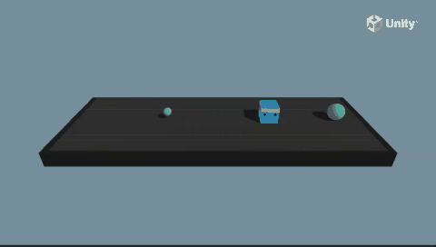

# Basic 예제 가이드



## 1. 개요

Basic은 ML-Agents의 가장 단순한 예제 환경입니다.
`Agent` 클래스를 상속받지 않고 `MonoBehaviour`에 직접 ML-Agents를 통합하는 방법을 보여줍니다.
에이전트는 1차원 선 위에서 움직이며, 작은 목표(위치 7) 또는 큰 목표(위치 17)에 도달해야 합니다.

**목표**: 좌우로 이동하여 목표 지점에 도달하는 단순한 이동 학습

### 학습 환경 구조

```
위치 0 ... 7(small) ... 10(시작) ... 17(large) ... 20
```

- 에이전트는 0~20 사이의 1차원 선 위에 위치
- 시작 위치는 항상 10
- 작은 목표(7) 도달: +0.1 보상
- 큰 목표(17) 도달: +1.0 보상
- 매 스텝마다 -0.01 페널티 (시간 penalty)

---

## 2. 코드 분석

### 2.1 BasicController.cs

`MonoBehaviour`를 상속받아 직접 ML-Agents를 통합하는 메인 컨트롤러입니다.

```csharp
public class BasicController : MonoBehaviour
{
    public float timeBetweenDecisionsAtInference;
    float m_TimeSinceDecision;
    public int position;          // 현재 위치 (0~20)
    const int k_SmallGoalPosition = 7;   // 작은 목표 위치
    const int k_LargeGoalPosition = 17;  // 큰 목표 위치
    const int k_MinPosition = 0;
    const int k_MaxPosition = 20;
    public const int k_Extents = k_MaxPosition - k_MinPosition;  // = 20
}
```

#### 주요 메서드

**Awake()** - RPC Communicator 등록
```csharp
public void Awake()
{
#if UNITY_EDITOR || UNITY_STANDALONE
    if (!CommunicatorFactory.CommunicatorRegistered)
    {
        Debug.Log("Registered Communicator.");
        CommunicatorFactory.Register<ICommunicator>(RpcCommunicator.Create);
    }
#endif
}
```
- `Agent`를 상속받지 않았으므로 직접 Communicator 등록 필요
- 에디터 또는 스탠드얼론 빌드에서만 동작

**OnEnable()** - 초기 위치 설정
```csharp
public void OnEnable()
{
    m_Agent = GetComponent<Agent>();
    position = 10;
    transform.position = new Vector3(position - 10f, 0f, 0f);
    smallGoal.transform.position = new Vector3(k_SmallGoalPosition - 10f, 0f, 0f);
    largeGoal.transform.position = new Vector3(k_LargeGoalPosition - 10f, 0f, 0f);
}
```
- 위치값 0~20을 Unity 좌표 -10~10으로 변환
- 즉, position 0 = x -10, position 10 = x 0, position 20 = x 10

**MoveDirection(int direction)** - 에이전트 이동 처리
```csharp
public void MoveDirection(int direction)
{
    position += direction;          // 방향(-1, 0, 1)만큼 이동
    if (position < k_MinPosition) { position = k_MinPosition; }
    if (position > k_MaxPosition) { position = k_MaxPosition; }
    gameObject.transform.position = new Vector3(position - 10f, 0f, 0f);

    m_Agent.AddReward(-0.01f);  // 스텝 당 패널티

    if (position == k_SmallGoalPosition)
    {
        m_Agent.AddReward(0.1f);
        m_Agent.EndEpisode();
        ResetAgent();
    }
    if (position == k_LargeGoalPosition)
    {
        m_Agent.AddReward(1f);
        m_Agent.EndEpisode();
        ResetAgent();
    }
}
```

**ResetAgent()** - 에피소드 리셋
```csharp
public void ResetAgent()
{
    SceneManager.LoadScene(SceneManager.GetActiveScene().name);
    m_Agent = null;
}
```
- 씬 전체를 다시 로드하는 방식 (비효율적이지만 테스트용)

**WaitTimeInference()** - 추론 시 의사결정 타이밍 제어
```csharp
void WaitTimeInference()
{
    if (Academy.Instance.IsCommunicatorOn)
        m_Agent?.RequestDecision();    // 학습 시: 매 스텝 요청
    else
    {
        // 추론 시: timeBetweenDecisionsAtInference 간격으로 요청
        if (m_TimeSinceDecision >= timeBetweenDecisionsAtInference)
        {
            m_TimeSinceDecision = 0f;
            m_Agent?.RequestDecision();
        }
        else
            m_TimeSinceDecision += Time.fixedDeltaTime;
    }
}
```

### 2.2 BasicSensorComponent.cs

커스텀 센서 컴포넌트 - 위치를 원-핫 인코딩으로 관찰합니다.

```csharp
public class BasicSensor : SensorBase
{
    public override void WriteObservation(float[] output)
    {
        Array.Clear(output, 0, output.Length);
        output[basicController.position] = 1;  // 현재 위치만 1
    }

    public override ObservationSpec GetObservationSpec()
    {
        return ObservationSpec.Vector(BasicController.k_Extents);  // 20차원
    }
}
```

- **20차원** 벡터 관찰 (위치 0~20)
- 현재 위치에 해당하는 인덱스만 1, 나머지는 0 (원-핫 인코딩)
- 예: position=7 → `[0,0,0,0,0,0,0,1,0,0,0,0,0,0,0,0,0,0,0,0]`

### 2.3 BasicActuatorComponent.cs

커스텀 액추에이터 - 3개의 이산 액션 중 하나를 선택합니다.

```csharp
ActionSpec m_ActionSpec = ActionSpec.MakeDiscrete(3);  // 3개 이산 액션

public void OnActionReceived(ActionBuffers actionBuffers)
{
    var movement = actionBuffers.DiscreteActions[0];
    var direction = 0;
    switch (movement)
    {
        case 1: direction = -1; break;  // 왼쪽
        case 2: direction = 1; break;   // 오른쪽
    }
    basicController.MoveDirection(direction);
}
```

**액션 공간**:
| 액션값 | 의미 |
|--------|------|
| 0 | 정지 |
| 1 | 왼쪽(-1) |
| 2 | 오른쪽(+1) |

---

## 3. 관찰-액션-보상 구조

| 항목 | 내용 |
|------|------|
| **관찰 (Observation)** | 20차원 원-핫 벡터 (에이전트의 현재 위치) |
| **액션 (Action)** | 이산(Discrete) 3개: 정지/왼쪽/오른쪽 |
| **보상 (Reward)** | 매 스텝 -0.01, 작은 목표 +0.1, 큰 목표 +1.0 |
| **종료 조건** | position == 7 또는 position == 17 |

---

## 4. 학습 실행

### 4.1 학습 설정 파일

`config/ppo/Basic.yaml` 또는 `config/sac/Basic.yaml` 참조.

```yaml
behaviors:
  Basic:
    trainer_type: ppo
    hyperparameters:
      batch_size: 64
      buffer_size: 2048
      learning_rate: 3.0e-4
      beta: 5.0e-4
      epsilon: 0.2
      lambd: 0.99
      num_epoch: 3
      learning_rate_schedule: linear
    network_settings:
      normalize: false
      hidden_units: 128
      num_layers: 2
    reward_signals:
      extrinsic:
        gamma: 0.99
        strength: 1.0
    max_steps: 100000
    time_horizon: 64
    summary_freq: 5000
    keep_checkpoints: 5
```

### 4.2 학습 명령어

```bash
mlagents-learn config/ppo/Basic.yaml --run-id=BasicTest1
```

### 4.3 추론 테스트

```bash
mlagents-learn config/ppo/Basic.yaml --run-id=BasicTest1 --inference
```

---

## 5. 실습 과제

### 과제 1: 보상 체계 변경
- 큰 목표 도달 시 +0.5, 작은 목표 도달 시 -0.1로 변경해보세요.
- 어떤 차이가 발생하는지 관찰하세요.

**힌트**: `BasicController.cs`의 `MoveDirection()` 메서드에서 `AddReward()` 값을 수정.

### 과제 2: 목표 위치 변경
- 작은 목표를 위치 3, 큰 목표를 위치 14로 변경해보세요.
- 학습 시간이 어떻게 달라지는지 확인하세요.

**힌트**: `k_SmallGoalPosition`과 `k_LargeGoalPosition` 상수값을 변경.

### 과제 3: 액션 추가
- "한 번에 2칸 점프" 액션을 추가해보세요. (Discrete 액션을 4개로 확장)
- 액션 3: +2 이동

**힌트**: 
1. `BasicActuatorComponent.cs`에서 `ActionSpec.MakeDiscrete(3)` → `ActionSpec.MakeDiscrete(4)`
2. `OnActionReceived()`에 `case 3: direction = 2; break;` 추가

### 과제 4: 센서 변경
- 원-핫 인코딩 대신 위치값을 그대로 실수로 전달해보세요.
- 20차원 → 1차원으로 변경했을 때 학습 속도 차이를 비교하세요.

**힌트**:
1. `BasicSensorComponent.cs`에서 `k_Extents` → 1로 변경
2. `WriteObservation()`에서 위치값을 0~1로 정규화하여 전달

### 과제 5: Curriculum Learning 적용
- 에이전트가 점점 더 먼 목표에 도달하도록 curriculum을 구성해보세요.
- 시작은 위치 12(2칸 거리) → 점차 17(7칸 거리)로 확장.

---

## 6. 전체 파일 구조와 각 파일의 의미

```
C: (.NET Assembly)
│   Basic.dll / Basic.dll.meta           # (컴파일된 어셈블리)
│
├── Scenes/
│   └── Basic.unity                      # (1) 씬 파일
│
├── Scripts/
│   ├── BasicController.cs               # (2) 메인 로직 (MonoBehaviour)
│   ├── BasicController.cs.meta
│   ├── BasicSensorComponent.cs          # (3) 커스텀 센서
│   ├── BasicSensorComponent.cs.meta
│   ├── BasicActuatorComponent.cs        # (4) 커스텀 액추에이터
│   └── BasicActuatorComponent.cs.meta
│
├── Prefabs/
│   ├── Basic.prefab                     # (5) 에이전트 프리팹
│   └── Basic.prefab.meta
│
├── TFModels/
│   ├── Basic.onnx                       # (6) 사전 학습된 ONNX 모델
│   └── Basic.onnx.meta
│
├── Demos/
│   ├── ExpertBasic.demo                 # (7) 전문가 데모 (모방 학습용)
│   └── ExpertBasic.demo.meta
│
└── 각종 .meta 파일                       # (8) Unity 에셋 관리 메타데이터
```

---

### (1) `Scenes/Basic.unity` — 씬 파일

Basic 예제의 유일한 씬입니다. 다른 예제들과 달리 3가지 변형이 없습니다.

**씬 계층 구조**:
```
Basic.unity
├── Main Camera
├── Basic          ← BasicController + Agent + BasicSensorComponent + BasicActuatorComponent
├── BasicSmallGoal (작은 목표, position 7)
├── BasicLargeGoal (큰 목표, position 17)
└── EventSystem
```

**특징**: 
- 학습 에이전트가 `Agent`를 상속받지 않고 `MonoBehaviour`에 Sensor/Actuator를 직접 조합
- 씬에 `Academy` 오브젝트가 없음 (필요시 자동 생성)
- 목표 오브젝트(BasicSmallGoal, BasicLargeGoal)가 각각 position 7, 17에 배치

### (2) `Scripts/BasicController.cs` — 메인 컨트롤러

`Agent` 상속 없이 ML-Agents를 직접 통합하는 핵심 스크립트입니다.

| 역할 | 설명 |
|------|------|
| 게임 로직 | position 값 관리, 목표 도달 감지, 에피소드 리셋 |
| ML-Agents 통합 | `GetComponent<Agent>()`로 Agent 참조 후 `AddReward()`, `EndEpisode()` 호출 |
| 의사결정 타이밍 | 학습 시 매 스텝, 추론 시 `timeBetweenDecisionsAtInference` 간격으로 `RequestDecision()` |

```csharp
// Agent가 아닌 MonoBehaviour가 Agent 메서드를 직접 호출
m_Agent.AddReward(-0.01f);       // 스텝 패널티
m_Agent.AddReward(0.1f);         // 작은 목표 보상
m_Agent.EndEpisode();            // 에피소드 종료
m_Agent.RequestDecision();       // 의사결정 요청
```

**독특한 리셋 방식**: `SceneManager.LoadScene()`으로 씬 전체를 다시 로드하는 방식 사용
- 장점: 모든 상태가 완전히 초기화됨
- 단점: 느리고 비효율적 (실전에서는 권장하지 않음)

### (3) `Scripts/BasicSensorComponent.cs` — 커스텀 센서

```csharp
public class BasicSensor : SensorBase
{
    public override void WriteObservation(float[] output)
    {
        Array.Clear(output, 0, output.Length);
        output[basicController.position] = 1;  // 20차원 원-핫 벡터
    }
}
```

| 항목 | 설정값 |
|------|--------|
| 센서 타입 | `SensorBase` 직접 상속 |
| 관찰 차원 | 20 (0~20 위치를 원-핫 인코딩) |
| 특징 | Agent의 `CollectObservations()`가 아닌 별도 컴포넌트로 분리 |

### (4) `Scripts/BasicActuatorComponent.cs` — 커스텀 액추에이터

```csharp
ActionSpec m_ActionSpec = ActionSpec.MakeDiscrete(3);  // 3개 이산 액션

public void OnActionReceived(ActionBuffers actionBuffers)
{
    var movement = actionBuffers.DiscreteActions[0];
    var direction = 0;
    switch (movement) { case 1: direction = -1; break; case 2: direction = 1; break; }
    basicController.MoveDirection(direction);
}
```

| 항목 | 설정값 |
|------|--------|
| 액추에이터 타입 | `IActuator` 직접 구현 |
| 액션 공간 | 이산 3개 (정지/왼쪽/오른쪽) |
| Observer | `Heuristic()`에서 키보드 입력 처리 |

### (5) `Prefabs/Basic.prefab` — 에이전트 프리팹

**프리팹 구조**:
```
Basic.prefab
└── Basic
    ├── Transform
    ├── Agent (ML-Agents 컴포넌트)
    ├── BasicController (스크립트)
    ├── BasicSensorComponent (커스텀 센서)
    ├── BasicActuatorComponent (커스텀 액추에이터)
    ├── Behavior Parameters
    │   ├── Behavior Name: "Basic"
    │   ├── Vector Obs: None (SensorComponent가 대체)
    │   └── Discrete Actions: 3
    └── Decision Requester
        └── Decision Period: 1
```

**Decision Requester**가 `Agent.RequestDecision()`을 자동 호출하여,
BasicController가 직접 `RequestDecision()`을 호출하지 않아도 됩니다.
(실제 BasicController는 자체 타이머로 호출하지만, Decision Requester도 함께 존재)

### (6) `TFModels/Basic.onnx` — 사전 학습 모델

| 항목 | 설명 |
|------|------|
| 입력 | 20차원 원-핫 벡터 |
| 출력 | 3개 이산 액션 확률 |
| 예상 성능 | Mean Reward: ~0.35 (빠르게 수렴) |
| 네트워크 | 2층 × 128유닛 MLP |

### (7) `Demos/ExpertBasic.demo` — 전문가 데모

사람이 Heuristic 모드로 플레이한 기록입니다. Behavioral Cloning(BC) 또는
GAIL(Generative Adversarial Imitation Learning) 학습에 사용할 수 있습니다.

### (8) `.meta` 파일 — Unity 메타데이터

모든 `.meta` 파일은 Unity가 각 에셋을 식별하고 관리하기 위한 GUID를 포함합니다.

| `.meta` 타입 | 용도 |
|-------------|------|
| 스크립트 `.cs.meta` | `MonoImporter`로 스크립트 GUID 관리 |
| 씬 `.unity.meta` | `DefaultImporter`로 씬 GUID 관리 |
| 프리팹 `.prefab.meta` | `NativeFormatImporter`로 프리팹 GUID 관리 |
| ONNX `.onnx.meta` | `ScriptedImporter`로 ONNX 임포트 설정 |
| 데모 `.demo.meta` | `ScriptedImporter`로 데모 임포트 설정 |
| 폴더 `.meta` | 폴더 구조 GUID (자동 생성) |

---

## 7. 핵심 포인트

- `Agent` 클래스 없이도 `MonoBehaviour` + `SensorComponent` + `ActuatorComponent`로 완전한 학습 환경 구축 가능
- 직접 `RequestDecision()` 호출로 의사결정 시점 제어
- 원-핫 인코딩 관찰의 전형적인 예
- 단순한 보상 구조로 RL 기초 학습에 적합
- `SceneManager.LoadScene`을 사용한 리셋 방식 (비효율적이지만 단순)
- `OnEnable()`에서 초기화하는 특이한 패턴 (Start/Awake 대신)
