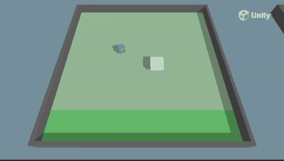

# PushBlock 예제 가이드



## 1. 개요

PushBlock은 에이전트가 주황색 블록을 밀어서 초록색 목표 지점까지 이동시키는 환경입니다.
기본(Single-Agent) 버전과 협력(Collaborative) 버전이 있습니다.

**목표**: 블록을 목표 지점까지 밀어서 도착시키기

### 학습 환경 구조

```
  [Goal] ← 초록색 목표 (도착 지점)
  
  [Block] ← 주황색 블록 (밀려야 할 대상)
  
  [Agent] ← 파란색 에이전트
    ↓↓↓
  (블록을 밀어서 Goal에 도달)
```

---

## 2. 코드 분석

### 2.1 PushAgentBasic.cs (Single-Agent)

기본 싱글 에이전트 스크립트입니다.

```csharp
public class PushAgentBasic : Agent
{
    public GameObject ground;
    public GameObject area;
    public Bounds areaBounds;
    public GameObject goal;
    public GameObject block;
    public GoalDetect goalDetect;
    public bool useVectorObs;
    
    Rigidbody m_BlockRb;
    Rigidbody m_AgentRb;
    Material m_GroundMaterial;
    Renderer m_GroundRenderer;
    EnvironmentParameters m_ResetParams;
}
```

#### Initialize() - 초기화
```csharp
public override void Initialize()
{
    goalDetect = block.GetComponent<GoalDetect>();
    goalDetect.agent = this;
    m_AgentRb = GetComponent<Rigidbody>();
    m_BlockRb = block.GetComponent<Rigidbody>();
    areaBounds = ground.GetComponent<Collider>().bounds;
    m_GroundRenderer = ground.GetComponent<Renderer>();
    m_GroundMaterial = m_GroundRenderer.material;
    m_ResetParams = Academy.Instance.EnvironmentParameters;
    SetResetParameters();
}
```

#### MoveAgent() - 액션 처리
```csharp
public void MoveAgent(ActionSegment<int> act)
{
    var dirToGo = Vector3.zero;
    var rotateDir = Vector3.zero;
    var action = act[0];

    switch (action)
    {
        case 1: dirToGo = transform.forward * 1f; break;    // 앞으로
        case 2: dirToGo = transform.forward * -1f; break;   // 뒤로
        case 3: rotateDir = transform.up * 1f; break;       // 우회전
        case 4: rotateDir = transform.up * -1f; break;      // 좌회전
        case 5: dirToGo = transform.right * -0.75f; break;  // 왼쪽
        case 6: dirToGo = transform.right * 0.75f; break;   // 오른쪽
    }
    transform.Rotate(rotateDir, Time.fixedDeltaTime * 200f);
    m_AgentRb.AddForce(dirToGo * m_PushBlockSettings.agentRunSpeed, ForceMode.VelocityChange);
}
```

**액션 공간**: 7개의 이산(Discrete) 액션
| 액션값 | 동작 |
|--------|------|
| 0 | 정지 |
| 1 | 앞으로 이동 |
| 2 | 뒤로 이동 |
| 3 | 오른쪽 회전 |
| 4 | 왼쪽 회전 |
| 5 | 왼쪽으로 이동 (0.75배 속도) |
| 6 | 오른쪽으로 이동 (0.75배 속도) |

#### OnActionReceived() - 보상 및 종료
```csharp
public override void OnActionReceived(ActionBuffers actionBuffers)
{
    MoveAgent(actionBuffers.DiscreteActions);
    AddReward(-1f / MaxStep);  // 매 스텝 패널티 (시간 제한)
}
```

#### GetRandomSpawnPos() - 랜덤 스폰 위치
```csharp
public Vector3 GetRandomSpawnPos()
{
    var foundNewSpawnLocation = false;
    var randomSpawnPos = Vector3.zero;
    while (foundNewSpawnLocation == false)
    {
        var randomPosX = Random.Range(-areaBounds.extents.x * m_PushBlockSettings.spawnAreaMarginMultiplier,
            areaBounds.extents.x * m_PushBlockSettings.spawnAreaMarginMultiplier);
        var randomPosZ = Random.Range(-areaBounds.extents.z * m_PushBlockSettings.spawnAreaMarginMultiplier,
            areaBounds.extents.z * m_PushBlockSettings.spawnAreaMarginMultiplier);
        randomSpawnPos = ground.transform.position + new Vector3(randomPosX, 1f, randomPosZ);
        if (Physics.CheckBox(randomSpawnPos, new Vector3(2.5f, 0.01f, 2.5f)) == false)
            foundNewSpawnLocation = true;
    }
    return randomSpawnPos;
}
```

- `spawnAreaMarginMultiplier`로 스폰 범위 조절 (Curriculum Learning)
- `Physics.CheckBox`로 다른 오브젝트와 겹치지 않는 위치 찾기

#### OnEpisodeBegin() - 에피소드 시작
```csharp
public override void OnEpisodeBegin()
{
    // 에리어 랜덤 회전 (일반화 학습)
    var rotation = Random.Range(0, 4);
    var rotationAngle = rotation * 90f;
    area.transform.Rotate(new Vector3(0f, rotationAngle, 0f));

    ResetBlock();
    transform.position = GetRandomSpawnPos();
    m_AgentRb.linearVelocity = Vector3.zero;
    m_AgentRb.angularVelocity = Vector3.zero;
    SetResetParameters();
}
```

#### ScoredAGoal() - 목표 달성
```csharp
public void ScoredAGoal()
{
    AddReward(5f);
    EndEpisode();
    StartCoroutine(GoalScoredSwapGroundMaterial(m_PushBlockSettings.goalScoredMaterial, 0.5f));
}
```

- 블록이 목표에 도달하면 +5 보상
- 바닥 재질이 성공 표시로 변경

#### SetResetParameters() - Curriculum Learning
```csharp
void SetResetParameters()
{
    SetGroundMaterialFriction();
    SetBlockProperties();
}

public void SetGroundMaterialFriction()
{
    groundCollider.material.dynamicFriction = m_ResetParams.GetWithDefault("dynamic_friction", 0);
    groundCollider.material.staticFriction = m_ResetParams.GetWithDefault("static_friction", 0);
}

public void SetBlockProperties()
{
    var scale = m_ResetParams.GetWithDefault("block_scale", 2);
    m_BlockRb.transform.localScale = new Vector3(scale, 0.75f, scale);
    m_BlockRb.linearDamping = m_ResetParams.GetWithDefault("block_drag", 0.5f);
}
```

- Curriculum Learning으로 마찰력, 블록 크기, 블록 항력 조절 가능

### 2.2 PushBlockSettings.cs

```csharp
public class PushBlockSettings : MonoBehaviour
{
    public float agentRunSpeed;
    public float agentRotationSpeed;
    public float spawnAreaMarginMultiplier;
    public Material goalScoredMaterial;
    public Material failMaterial;
}
```

### 2.3 GoalDetect.cs

블록에 부착되어 목표 도달을 감지하는 트리거입니다.

```csharp
public class GoalDetect : MonoBehaviour
{
    [HideInInspector]
    public PushAgentBasic agent;

    void OnCollisionEnter(Collision col)
    {
        if (col.gameObject.CompareTag("goal"))
            agent.ScoredAGoal();
    }
}
```

- 블록이 "goal" 태그와 충돌하면 에이전트의 `ScoredAGoal()` 호출

### 2.4 PushAgentCollab.cs (Collaborative)

협력 시나리오의 에이전트입니다.

```csharp
public class PushAgentCollab : Agent
{
    public override void OnActionReceived(ActionBuffers actionBuffers)
    {
        MoveAgent(actionBuffers.DiscreteActions);
        // PushAgentBasic과 달리 자체 보상 없음
        // EnvController에서 그룹 보상 처리
    }
}
```

- 협력 버전에서는 개별 보상이 없고 `SimpleMultiAgentGroup`을 통해 그룹 보상 적용
- `PushBlockEnvController`가 모든 에이전트의 행동을 관리

### 2.5 PushBlockEnvController.cs

협력 시나리오의 환경 컨트롤러입니다.

```csharp
public class PushBlockEnvController : MonoBehaviour
{
    public List<PlayerInfo> AgentsList = new List<PlayerInfo>();
    public List<BlockInfo> BlocksList = new List<BlockInfo>();
    private SimpleMultiAgentGroup m_AgentGroup;
    private int m_NumberOfRemainingBlocks;
    private int m_ResetTimer;
    
    void Start()
    {
        m_AgentGroup = new SimpleMultiAgentGroup();
        foreach (var item in AgentsList)
            m_AgentGroup.RegisterAgent(item.Agent);
        ResetScene();
    }

    void FixedUpdate()
    {
        m_ResetTimer += 1;
        if (m_ResetTimer >= MaxEnvironmentSteps)
        {
            m_AgentGroup.GroupEpisodeInterrupted();
            ResetScene();
        }
        m_AgentGroup.AddGroupReward(-0.5f / MaxEnvironmentSteps);
    }

    public void ScoredAGoal(Collider col, float score)
    {
        m_NumberOfRemainingBlocks--;
        bool done = m_NumberOfRemainingBlocks == 0;
        col.gameObject.SetActive(false);
        m_AgentGroup.AddGroupReward(score);
        if (done)
        {
            m_AgentGroup.EndGroupEpisode();
            ResetScene();
        }
    }
}
```

- `SimpleMultiAgentGroup`: 모든 에이전트가 동일한 보상을 공유
- 모든 블록이 목표에 도달하면 에피소드 종료
- 각 블록마다 `GoalDetectTrigger`가 감지

### 2.6 GoalDetectTrigger.cs

협력 버전의 범용 트리거 감지기입니다.

```csharp
public class GoalDetectTrigger : MonoBehaviour
{
    public string tagToDetect = "goal";
    public float GoalValue = 1;
    public TriggerEvent onTriggerEnterEvent = new TriggerEvent();

    void OnTriggerEnter(Collider col)
    {
        if (col.CompareTag(tagToDetect))
            onTriggerEnterEvent.Invoke(m_col, GoalValue);
    }
}
```

- UnityEvent를 사용하여 Inspector에서 이벤트 연결 가능
- 범용적으로 다양한 충돌 감지에 사용

---

## 3. 관찰-액션-보상 구조

### Single-Agent (PushAgentBasic)

| 항목 | 내용 |
|------|------|
| **관찰** | Vector Observation (useVectorObs) |
| **액션** | 이산 7개 (이동/회전 6방향 + 정지) |
| **보상** | 매 스텝 -1/MaxStep, 목표 달성 +5 |

### Collaborative (PushBlockCollab)

| 항목 | 내용 |
|------|------|
| **관찰** | 각 에이전트 개별 관찰 |
| **액션** | 이산 7개 (동일) |
| **보상** | 그룹 보상: 블록당 score, 매 스텝 -0.5/MaxEnvironmentSteps |

---

## 4. 학습 실행

### 4.1 Single-Agent 학습
```bash
mlagents-learn config/ppo/PushBlock.yaml --run-id=PushBlockTest1
```

### 4.2 Collaborative 학습
```bash
mlagents-learn config/poca/PushBlock.yaml --run-id=PushBlockCollab1
```

### 4.3 학습 설정 (config/ppo/PushBlock.yaml)
```yaml
behaviors:
  PushBlock:
    trainer_type: ppo
    hyperparameters:
      batch_size: 64
      buffer_size: 2048
      learning_rate: 3.0e-4
      beta: 5.0e-4
      epsilon: 0.2
      lambd: 0.99
      num_epoch: 3
      learning_rate_schedule: linear
    network_settings:
      normalize: false
      hidden_units: 128
      num_layers: 2
    reward_signals:
      extrinsic:
        gamma: 0.99
        strength: 1.0
    max_steps: 2000000
    time_horizon: 64
    summary_freq: 30000
    keep_checkpoints: 5
```

---

## 5. 실습 과제

### 과제 1: Curriculum Learning 구현
- 블록 크기를 점점 작게, 마찰력을 점점 높여서 난이도를 조절하는 Curriculum을 구성하세요.
- `block_scale: 2.0 → 1.5 → 1.0`, `dynamic_friction: 0 → 0.5 → 1.0`

### 과제 2: 보상 구조 변경
- 목표 달성 보상을 +5에서 +10으로 변경하고 학습 속도 비교
- 매 스텝 패널티를 -1/MaxStep에서 -2/MaxStep으로 변경

### 과제 3: 협력 PushBlock 학습
- PushBlockCollab 씬에서 2명의 에이전트가 2개의 블록을 밀도록 학습
- MA-POCA 트레이너를 사용하여 협력 학습

### 과제 4: Action Space 변경
- 연속(Continuous) 액션 공간으로 변경하여 학습 비교
- 이산 액션 vs 연속 액션의 장단점 분석

### 과제 5: 에이전트 시각적 표시
- `GoalDetectTrigger`의 UnityEvent를 사용하여 성공/실패 시 시각적 피드백 추가

---

## 6. 전체 파일 구조와 각 파일의 의미

```
PushBlock/
├── Scenes/
│   ├── PushBlock.unity                     # (1) Single-Agent 씬
│   └── PushBlockCollab.unity               # (2) Collaborative 씬
│
├── Scripts/
│   ├── PushAgentBasic.cs                   # (3) 싱글 에이전트
│   ├── PushAgentCollab.cs                  # (4) 협력 에이전트
│   ├── PushBlockEnvController.cs           # (5) 협력 환경 컨트롤러
│   ├── PushBlockSettings.cs                # (6) 공통 설정
│   ├── GoalDetect.cs                       # (7) 충돌 감지 (Basic)
│   └── GoalDetectTrigger.cs                # (8) 범용 트리거 (Collab)
│
├── Prefabs/
│   ├── PushBlockArea.prefab                # (9) 싱글 영역 프리팹
│   └── PushBlockCollabAreaGrid.prefab      # (10) 협력 영역 프리팹
│
├── Meshes/
│   └── PushBlockCourt.fbx                  # (11) 경기장 3D 메시
│
├── TFModels/
│   ├── PushBlock.onnx                      # (12) 싱글 ONNX
│   └── PushBlockCollab.onnx                # (13) 협력 ONNX
│
└── Demos/
    └── ExpertPushBlock.demo                # (14) 전문가 데모
```

---

### (1) `Scenes/PushBlock.unity` — Single-Agent 씬

**씬 계층 구조**:
```
PushBlock.unity
├── Main Camera
├── PushBlockSettings    ← PushBlockSettings.cs (마찰력, 블록 속성)
├── Area (PushBlockArea) ← PushBlockArea.prefab
│   ├── PushAgentBasic   ← PushAgentBasic.cs
│   ├── Block            ← 주황색 블록 (Rigidbody + GoalDetect)
│   ├── Goal             ← 초록색 목표 지점
│   ├── Wall/Floor       ← 경기장
│   └── Wall/Floor ...
└── EventSystem
```

**PushBlockSettings**는 `EnvironmentParameters` 콜백을 등록하여
Curriculum Learning 시 마찰력, 블록 크기, 블록 항력을 동적으로 변경합니다.

### (2) `Scenes/PushBlockCollab.unity` — Collaborative 씬

- 싱글 버전과 동일하나 `PushBlockCollabAreaGrid.prefab` 사용
- 2명의 에이전트 + 2개의 블록 + 2개의 골
- `PushBlockEnvController`가 전체 흐름 제어
- 학습 시 `config/poca/PushBlock.yaml` 필요

### (3) `Scripts/PushAgentBasic.cs` — 싱글 에이전트

| 기능 | 설명 |
|------|------|
| 액션 | 이산 7개 (정지/전진/후진/좌회전/우회전/좌측/우측) |
| 보상 | 매 스텝 `-1/MaxStep`, 목표 달성 `+5` |
| 스폰 | `Physics.CheckBox`로 충돌 없는 위치 찾기 |
| Curriculum | `SetGroundMaterialFriction()`, `SetBlockProperties()` |

```csharp
// 7개 이산 액션 매핑
case 1: dirToGo = transform.forward * 1f;          // 전진
case 2: dirToGo = transform.forward * -1f;         // 후진
case 3: rotateDir = transform.up * 1f;             // 우회전
case 4: rotateDir = transform.up * -1f;            // 좌회전
case 5: dirToGo = transform.right * -0.75f;        // 좌측
case 6: dirToGo = transform.right * 0.75f;         // 우측
```

### (4) `Scripts/PushAgentCollab.cs` — 협력 에이전트

```csharp
public class PushAgentCollab : Agent
{
    public override void OnActionReceived(ActionBuffers actionBuffers)
    {
        MoveAgent(actionBuffers.DiscreteActions);
        // 개별 보상 없음 — EnvController가 그룹 보상 처리
    }
}
```

- PushAgentBasic과 달리 자체 보상 로직 없음
- `PushBlockEnvController`의 `SimpleMultiAgentGroup`이 보상 관리
- 행동만 수행하고 평가는 시스템에 위임

### (5) `Scripts/PushBlockEnvController.cs` — 협력 환경 컨트롤러

**SimpleMultiAgentGroup을 사용한 그룹 보상**:
```csharp
m_AgentGroup = new SimpleMultiAgentGroup();
foreach (var item in AgentsList)
    m_AgentGroup.RegisterAgent(item.Agent);

// 모든 블록이 목표 도달 시 그룹 보상 + 에피소드 종료
public void ScoredAGoal(Collider col, float score)
{
    m_NumberOfRemainingBlocks--;
    m_AgentGroup.AddGroupReward(score);
    if (m_NumberOfRemainingBlocks == 0)
    {
        m_AgentGroup.EndGroupEpisode();
        ResetScene();
    }
}
```

### (6) `Scripts/PushBlockSettings.cs` — 공통 설정

| 필드 | 기본값 | 설명 |
|------|--------|------|
| `agentRunSpeed` | Inspector 지정 | 에이전트 이동 속도 |
| `agentRotationSpeed` | Inspector 지정 | 에이전트 회전 속도 |
| `spawnAreaMarginMultiplier` | 0.9 | 스폰 범위 마진 |
| `goalScoredMaterial` | Inspector 지정 | 성공 시 바닥 재질 |
| `failMaterial` | Inspector 지정 | 실패 시 바닥 재질 |

### (7) `Scripts/GoalDetect.cs` — 충돌 감지 (Basic)

블록에 부착되어 블록이 Goal에 닿았는지 감지합니다.

```csharp
void OnCollisionEnter(Collision col)
{
    if (col.gameObject.CompareTag("goal"))
        agent.ScoredAGoal();   // PushAgentBasic.ScoredAGoal() 호출
}
```

### (8) `Scripts/GoalDetectTrigger.cs` — 범용 트리거 (Collab)

**UnityEvent 기반의 유연한 설계**:
```csharp
[System.Serializable]
public class TriggerEvent : UnityEvent<Collider, float> { }

public string tagToDetect = "goal";
public float GoalValue = 1;
public TriggerEvent onTriggerEnterEvent = new TriggerEvent();

void OnTriggerEnter(Collider col)
{
    if (col.CompareTag(tagToDetect))
        onTriggerEnterEvent.Invoke(col, GoalValue);
}
```

Inspector에서 `onTriggerEnterEvent`에 `PushBlockEnvController.ScoredAGoal`을
직접 연결할 수 있습니다. 이로 인해 GoalDetectTrigger 자체는 어떤 스크립트에도
의존하지 않는 **재사용 가능한 컴포넌트**가 됩니다.

### (9) `Prefabs/PushBlockArea.prefab` — 싱글 영역

프리팹 구성:
- PushAgentBasic (Agent, Behavior Parameters)
- Block (Rigidbody, GoalDetect, "block" 태그)
- Goal ("goal" 태그, 초록색)
- 4면 Walls + Floor
- SpawnArea 마커

### (10) `Prefabs/PushBlockCollabAreaGrid.prefab` — 협력 영역

싱글 영역과 달리 다음이 포함됨:
- PushAgentCollab × 2
- Block × 2
- Goal × 2
- PushBlockEnvController
- 격자 무늬 Floor

### (11) `Meshes/PushBlockCourt.fbx` — 경기장 3D 메시

FBX 포맷의 3D 모델 파일. PushBlock 경기장의 벽과 바닥 형태를 정의합니다.

| FBX 항목 | 용도 |
|---------|------|
| Polygon Mesh | PushBlockCourt 형태 |
| UV 데이터 | 텍스처 매핑 |
| Transform 계층 | 벽/바닥 구조 |

### (12) `TFModels/PushBlock.onnx` — 싱글 ONNX

| 항목 | 설명 |
|------|------|
| 입력 | 7개 이산 액션 확률 |
| 출력 | 행동 가치 |
| 네트워크 | 2층 × 128유닛 |
| 행동 이름 | "PushBlock" |

### (13) `TFModels/PushBlockCollab.onnx` — 협력 ONNX

MA-POCA로 학습된 협력 모델입니다. 다른 에이전트의 상태를 고려한 정책을 학습합니다.

### (14) `Demos/ExpertPushBlock.demo` — 전문가 데모

사람이 직접 조작하여 블록을 목표까지 밀어넣은 기록입니다.
Behavioral Cloning의 Reference 전문가 궤적으로 사용됩니다.

---

## 7. 핵심 포인트

- 블록 푸싱 문제의 전형적인 RL 예제
- Single-Agent와 Multi-Agent 협력의 비교
- `SimpleMultiAgentGroup`을 사용한 그룹 보상
- `Physics.CheckBox`로 충돌 없는 스폰 위치 생성
- Curriculum Learning을 위한 다양한 환경 파라미터
- UnityEvent 기반의 유연한 트리거 시스템
- 에리어 회전 랜덤화로 일반화 성능 향상
