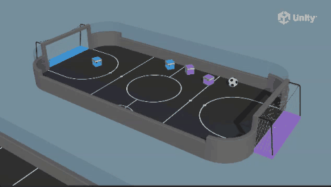

# Soccer 예제 가이드



## 1. 개요

Soccer는 두 팀(파랑/보라)이 축구를 하는 다중 에이전트 환경입니다.
각 팀은 2명의 Striker와 1명의 Goalie로 구성되며, 상대 골대에 공을 넣기 위해
경쟁합니다. SimpleMultiAgentGroup을 사용한 팀 보상 구조를 학습합니다.

**목표**: 상대 팀 골대에 공을 넣어 승리하기

### 학습 환경 구조

```
┌─────────────────────────────────────┐
│  [Purple Goal]          [Blue Goal]  │
│  ┌──────┐               ┌──────┐    │
│  │ Goal │               │ Goal │    │
│  └──────┘               └──────┘    │
│   S1  S2                             │
│      ○ Ball              S3  S4     │
│   G1                    G2          │
│  Purple Team            Blue Team   │
└─────────────────────────────────────┘
S: Striker, G: Goalie
```

---

## 2. 코드 분석

### 2.1 AgentSoccer.cs

개별 축구 에이전트입니다.

```csharp
public enum Team { Blue = 0, Purple = 1 }

public class AgentSoccer : Agent
{
    public enum Position { Striker, Goalie, Generic }

    [HideInInspector] public Team team;
    float m_KickPower;
    float m_BallTouch;  // 커리큘럼 파라미터
    public Position position;

    const float k_Power = 2000f;
    float m_Existential;
    float m_LateralSpeed;
    float m_ForwardSpeed;

    [HideInInspector] public Rigidbody agentRb;
    SoccerSettings m_SoccerSettings;
    BehaviorParameters m_BehaviorParameters;
    public Vector3 initialPos;
    public float rotSign;
}
```

#### Initialize() - 위치별 속도 설정
```csharp
public override void Initialize()
{
    SoccerEnvController envController = GetComponentInParent<SoccerEnvController>();
    m_Existential = 1f / envController.MaxEnvironmentSteps;  // 존재 보상

    m_BehaviorParameters = gameObject.GetComponent<BehaviorParameters>();
    if (m_BehaviorParameters.TeamId == (int)Team.Blue)
    {
        team = Team.Blue;
        initialPos = new Vector3(transform.position.x - 5f, .5f, transform.position.z);
        rotSign = 1f;
    }
    else
    {
        team = Team.Purple;
        initialPos = new Vector3(transform.position.x + 5f, .5f, transform.position.z);
        rotSign = -1f;
    }

    // 포지션별 이동 속도
    if (position == Position.Goalie) {
        m_LateralSpeed = 1.0f;    // 골키퍼: 좌우 빠름
        m_ForwardSpeed = 1.0f;
    } else if (position == Position.Striker) {
        m_LateralSpeed = 0.3f;    // 공격수: 전진 빠름, 좌우 느림
        m_ForwardSpeed = 1.3f;
    } else {
        m_LateralSpeed = 0.3f;
        m_ForwardSpeed = 1.0f;
    }
}
```

**포지션별 속도 차이**:
| 포지션 | 전진 속도 | 좌우 속도 | 전략 |
|--------|----------|----------|------|
| Striker | 1.3 (빠름) | 0.3 (느림) | 골대를 향해 전진 위주 |
| Goalie | 1.0 (보통) | 1.0 (보통) | 좌우 이동 균형 |
| Generic | 1.0 (보통) | 0.3 (느림) | 일반 포지션 |

#### MoveAgent() - 이산 액션
```csharp
public void MoveAgent(ActionSegment<int> act)
{
    m_KickPower = 0f;
    var forwardAxis = act[0];
    var rightAxis = act[1];
    var rotateAxis = act[2];

    switch (forwardAxis) {
        case 1: dirToGo = transform.forward * m_ForwardSpeed; m_KickPower = 1f; break;
        case 2: dirToGo = transform.forward * -m_ForwardSpeed; break;
    }
    switch (rightAxis) {
        case 1: dirToGo = transform.right * m_LateralSpeed; break;
        case 2: dirToGo = transform.right * -m_LateralSpeed; break;
    }
    switch (rotateAxis) {
        case 1: rotateDir = transform.up * -1f; break;
        case 2: rotateDir = transform.up * 1f; break;
    }

    transform.Rotate(rotateDir, Time.deltaTime * 100f);
    agentRb.AddForce(dirToGo * m_SoccerSettings.agentRunSpeed, ForceMode.VelocityChange);
}
```

**액션 공간**: 3차원 이산 액션 (각각 3개 값: None/Positive/Negative)
| 차원 | Action 0 | Action 1 | Action 2 |
|------|----------|----------|----------|
| 0 | None | None | None |
| 1 | 전진 (발차기) | 오른쪽 이동 | 좌회전 |
| 2 | 후진 | 왼쪽 이동 | 우회전 |

- `forwardAxis == 1`일 때만 발차기(`m_KickPower = 1f`)

#### OnActionReceived() - 존재 보상
```csharp
public override void OnActionReceived(ActionBuffers actionBuffers)
{
    if (position == Position.Goalie)
        AddReward(m_Existential);       // 골키퍼: 생존 보상 (+)
    else if (position == Position.Striker)
        AddReward(-m_Existential);      // 공격수: 생존 패널티 (-)

    MoveAgent(actionBuffers.DiscreteActions);
}
```

- Goalie: 매 스텝 작은 양의 보상 → 오래 버티도록 학습
- Striker: 매 스텝 작은 패널티 → 빨리 골 넣도록 학습

#### OnCollisionEnter() - 공 충돌 및 발차기
```csharp
void OnCollisionEnter(Collision c)
{
    var force = k_Power * m_KickPower;
    if (position == Position.Goalie)
        force = k_Power;  // 골키퍼는 항상 강한 발차기

    if (c.gameObject.CompareTag("ball"))
    {
        AddReward(.2f * m_BallTouch);  // 공 접촉 보상
        var dir = c.contacts[0].point - transform.position;
        dir = dir.normalized;
        c.gameObject.GetComponent<Rigidbody>().AddForce(dir * force);
    }
}
```

- Goalie는 항상 `k_Power`의 힘으로 발차기 (최대 힘)
- `m_BallTouch`는 커리큘럼 파라미터 (`ball_touch`)

### 2.2 SoccerEnvController.cs

경기장 컨트롤러로 멀티 에이전트 그룹을 관리합니다.

```csharp
public class SoccerEnvController : MonoBehaviour
{
    public int MaxEnvironmentSteps = 25000;
    public GameObject ball;
    public Rigidbody ballRb;
    public List<PlayerInfo> AgentsList = new List<PlayerInfo>();

    private SimpleMultiAgentGroup m_BlueAgentGroup;
    private SimpleMultiAgentGroup m_PurpleAgentGroup;
    private int m_ResetTimer;
}
```

#### Start() - 에이전트 그룹 등록
```csharp
void Start()
{
    m_BlueAgentGroup = new SimpleMultiAgentGroup();
    m_PurpleAgentGroup = new SimpleMultiAgentGroup();

    foreach (var item in AgentsList)
    {
        if (item.Agent.team == Team.Blue)
            m_BlueAgentGroup.RegisterAgent(item.Agent);
        else
            m_PurpleAgentGroup.RegisterAgent(item.Agent);
    }
    ResetScene();
}
```

#### GoalTouched() - 골 보상
```csharp
public void GoalTouched(Team scoredTeam)
{
    if (scoredTeam == Team.Blue)
    {
        m_BlueAgentGroup.AddGroupReward(1 - (float)m_ResetTimer / MaxEnvironmentSteps);
        m_PurpleAgentGroup.AddGroupReward(-1);
    }
    else
    {
        m_PurpleAgentGroup.AddGroupReward(1 - (float)m_ResetTimer / MaxEnvironmentSteps);
        m_BlueAgentGroup.AddGroupReward(-1);
    }
    m_PurpleAgentGroup.EndGroupEpisode();
    m_BlueAgentGroup.EndGroupEpisode();
    ResetScene();
}
```

**팀 보상 구조**:
- 득점 팀: `1 - (경과시간/최대시간)` — 빠를수록 높은 보상
- 실점 팀: `-1` — 패널티
- `EndGroupEpisode()`로 팀 전체 에피소드 종료

#### FixedUpdate() - 타임아웃
```csharp
void FixedUpdate()
{
    m_ResetTimer += 1;
    if (m_ResetTimer >= MaxEnvironmentSteps)
    {
        m_BlueAgentGroup.GroupEpisodeInterrupted();
        m_PurpleAgentGroup.GroupEpisodeInterrupted();
        ResetScene();
    }
}
```

### 2.3 SoccerBallController.cs

골 감지 로직입니다.

```csharp
public class SoccerBallController : MonoBehaviour
{
    public string purpleGoalTag;
    public string blueGoalTag;

    void OnCollisionEnter(Collision col)
    {
        if (col.gameObject.CompareTag(purpleGoalTag))
            envController.GoalTouched(Team.Blue);  // 보라 골 → 파랑 득점
        if (col.gameObject.CompareTag(blueGoalTag))
            envController.GoalTouched(Team.Purple); // 파랑 골 → 보라 득점
    }
}
```

### 2.4 SoccerSettings.cs

```csharp
public class SoccerSettings : MonoBehaviour
{
    public Material purpleMaterial;
    public Material blueMaterial;
    public bool randomizePlayersTeamForTraining = true;
    public float agentRunSpeed;
}
```

- `randomizePlayersTeamForTraining`: 학습 시 팀 색상을 랜덤화하여 일반화

---

## 3. 관찰-액션-보상 구조

| 항목 | 내용 |
|------|------|
| **관찰** | (AgentSoccer는 별도 CollectObservations 없음 → 기본 관찰) |
| **액션** | 3차원 이산 (전진/후진, 좌우, 회전) |
| **보상** | 팀 단위: 득점 시 빠를수록 높은 보상, 실점 시 -1 |
| **종료 조건** | 골 발생 or MaxStep 도달 |
| **특징** | SimpleMultiAgentGroup, 팀 보상, Self-Play |

---

## 4. 학습 실행

### 4.1 학습 명령어
```bash
mlagents-learn config/ppo/Soccer.yaml --run-id=SoccerTest1
```

### 4.2 학습 설정
```yaml
behaviors:
  Soccer:
    trainer_type: ppo
    hyperparameters:
      batch_size: 128
      buffer_size: 2048
      learning_rate: 3.0e-4
      beta: 5.0e-4
      epsilon: 0.2
      lambd: 0.99
      num_epoch: 3
      learning_rate_schedule: linear
    network_settings:
      normalize: false
      hidden_units: 256
      num_layers: 2
    reward_signals:
      extrinsic:
        gamma: 0.99
        strength: 1.0
    max_steps: 5000000
    time_horizon: 64
    summary_freq: 10000
    keep_checkpoints: 5
    self_play:
      window: 10
      play_against_latest_model_ratio: 0.5
      save_steps: 20000
      swap_steps: 10000
      team_change: 100000
```

---

## 5. 실습 과제

### 과제 1: Self-Play로 학습
- Self-Play 설정에서 `team_change` 간격을 50000, 200000으로 변경
- 팀 전환 빈도가 학습에 미치는 영향 분석

### 과제 2: 포지션 전략 변경
- Striker와 Goalie의 속도 파라미터 변경 (예: Striker 좌우 속도 0.5)
- 포지션별 최적 속도 찾기

### 과제 3: 팀 규모 변경
- 3v3, 5v5 등 팀 규모 확장
- 각 에이전트 추가 시 포지션 할당 전략 수립

### 과제 4: 보상 구조 변경
- 실점 패널티를 -1에서 -0.5로 낮추기
- 득점 보상 함수 (1 - t/T)를 고정값 1로 변경
- 보상 변화에 따른 전략 차이 분석

### 과제 5: 커리큘럼 학습
- `ball_touch` 파라미터를 0에서 시작하여 점진적 증가
- 공 접촉 보상이 학습 초기에 미치는 영향

---

## 6. 전체 파일 구조와 각 파일의 의미

```
Soccer/
├── Scenes/
│   ├── SoccerTwos.unity                       # (1) 2vs2 씬
│   ├── SoccerOneVsOne.unity                   # (2) 1vs1 씬
│   └── Soccer/                                # (3) 라이트맵 데이터
│       └── LightingData.asset
│
├── Scripts/
│   ├── SoccerPlayerAgent.cs                   # (4) 공통 Agent
│   ├── SoccerBallController.cs                # (5) 공 제어
│   ├── SoccerEnvController.cs                 # (6) 환경/라운드 관리
│   ├── AgentSoccer.cs                         # (7) 팀/포지션 설정
│   └── SoccerSettings.cs                      # (8) 환경 설정
│
├── Prefabs/
│   ├── Player.prefab                          # (9) 선수 프리팹
│   ├── Ball.prefab                            # (10) 공 프리팹
│   └── SoccerField.prefab                     # (11) 경기장 프리팹
│
├── TFModels/
│   ├── SoccerTwos.onnx                        # (12) 2vs2 ONNX
│   └── SoccerOneVsOne.onnx                    # (13) 1vs1 ONNX
│
└── Demos/
    └── ExpertSoccer.demo                      # (14) 전문가 데모
```

---

### (1) `Scenes/SoccerTwos.unity` — 2vs2 씬

**씬 계층 구조**:
```
SoccerTwos.unity
├── Main Camera × 4 (각 에이전트 전용)
├── SoccerSettings
├── SoccerEnvController (환경 컨트롤러)
├── SoccerField (SoccerField.prefab)
│   ├── Ball (Ball.prefab)
│   ├── GoalLineL / GoalLineR (골라인)
│   ├── StrikerL / StrikerR (공격수 Player.prefab × 2)
│   └── GoalkeeperL / GoalkeeperR (골키퍼 Player.prefab × 2)
├── Academy (MA-POCA 그룹)
└── EventSystem
```

**MA-POCA 멀티 에이전트**: 4명의 에이전트(공격수 2 + 골키퍼 2)가
2개의 SimpleMultiAgentGroup(팀)으로 나뉘어 경쟁합니다.

### (2) `Scenes/SoccerOneVsOne.unity` — 1vs1 씬

SoccerTwos와 동일하나 선수가 각 팀 1명씩만 있습니다.
(Striker + Goalkeeper 각 1명 = 총 2명)

### (3) `Scenes/Soccer/` — 라이트맵

### (4) `Scripts/SoccerPlayerAgent.cs` — 공통 Agent

| 기능 | 설명 |
|------|------|
| 액션 | 이산 8개 (앞/뒤/좌/우/회전 + 정지) |
| 관찰 | RayPerception 6개 광선 (3개 방향 × 2 레이) |
| 보상 | 골: +1 (팀 전체), 실점: -1 (팀 전체) |
| **팀 인식** | 자가 관찰에 팀 ID 포함 → 적/아군 구분 학습 |

```csharp
public override void CollectObservations(VectorSensor sensor)
{
    // 팀 인식: 자신의 팀을 1로, 상대 팀을 -1로 인코딩
    sensor.AddObservation(m_Team == Team.Blue ? 1 : -1);
}
```

### (5) `Scripts/SoccerBallController.cs` — 공 제어

```csharp
public class SoccerBallController : MonoBehaviour
{
    void OnCollisionEnter(Collision col)
    {
        if (col.gameObject.CompareTag("goalL"))
        {
            envController.GoalTouched(Team.Blue);  // 파란팀 골
        }
        else if (col.gameObject.CompareTag("goalR"))
        {
            envController.GoalTouched(Team.Purple);  // 보라팀 골
        }
    }
}
```

- 공이 골라인에 닿으면 `SoccerEnvController.GoalTouched()` 호출
- 공 리셋 (중앙으로)
- 골 상황 초기화

### (6) `Scripts/SoccerEnvController.cs` — 환경/라운드 관리

```csharp
public class SoccerEnvController : MonoBehaviour
{
    public SimpleMultiAgentGroup blueTeam;
    public SimpleMultiAgentGroup purpleTeam;
    
    public void GoalTouched(Team scoredTeam)
    {
        blueTeam.AddGroupReward(scoredTeam == Team.Blue ? 1f : -1f);
        purpleTeam.AddGroupReward(scoredTeam == Team.Purple ? 1f : -1f);
        
        if (++round >= maxRound)
        {
            blueTeam.EndGroupEpisode();
            purpleTeam.EndGroupEpisode();
        }
        ResetScene();
    }
}
```

### (7) `Scripts/AgentSoccer.cs` — 팀/포지션 설정

```csharp
public enum Team { Blue, Purple }
public enum Position { Striker, Goalkeeper }

public class AgentSoccer : MonoBehaviour
{
    public Team team;
    public Position position;
    public float punchForce = 5f;
    
    public override void Heuristic(float[] actionsOut)
    {
        // 키보드 입력으로 선수 조작
    }
}
```

### (8) `Scripts/SoccerSettings.cs` — 환경 설정

### (9) `Prefabs/Player.prefab` — 선수 프리팹

```
Player.prefab
├── Body (CapsuleCollider + Rigidbody)
├── AgentSoccer (팀/포지션 할당)
├── SoccerPlayerAgent (Agent)
├── Behavior Parameters
├── Decision Requester
└── SoccerPlayerTarget (시각적 방향 표시기)
```

### (10) `Prefabs/Ball.prefab` — 공 프리팹

공 (Sphere) + Rigidbody + SoccerBallController

### (11) `Prefabs/SoccerField.prefab` — 경기장 프리팹

```
SoccerField.prefab
├── Field (평면 경기장)
├── GoalLineL (왼쪽 골라인, tag=goalL)
├── GoalLineR (오른쪽 골라인, tag=goalR)
├── Walls (4면 경계)
└── RestartPositions (리셋 위치 마커)
```

### (12) `TFModels/SoccerTwos.onnx` — 2vs2 ONNX

| 항목 | 설명 |
|------|------|
| 학습기 | MA-POCA |
| 에이전트 | 4명 (2팀 × 2명) |

### (13) `TFModels/SoccerOneVsOne.onnx` — 1vs1 ONNX

| 항목 | 설명 |
|------|------|
| 학습기 | MA-POCA |
| 에이전트 | 2명 (1vs1) |

### (14) `Demos/ExpertSoccer.demo` — 전문가 데모

---

## 7. 핵심 포인트

- **SimpleMultiAgentGroup**을 사용한 팀 단위 학습
- Self-Play 지원으로 점진적 실력 향상
- **포지션별 역할 차별화** (Striker/Goalie 속도 차이)
- 골키퍼: 생존 보상 (+) / 공격수: 생존 패널티 (-)
- 전진 시 자동 발차기 (`forwardAxis == 1`)
- 빠른 골 = 더 높은 보상 (시간 할인)
- 에피소드 리셋 시 랜덤 위치/회전으로 일반화
- 팀 색상 랜덤화 (`randomizePlayersTeamForTraining`)
