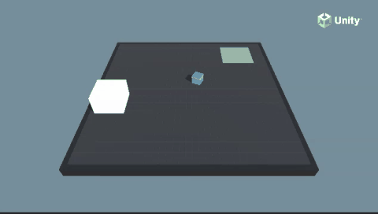

# WallJump 예제 가이드



## 1. 개요

WallJump는 에이전트가 벽을 넘어 목표 지점에 도달해야 하는 환경입니다.
벽의 높이가 다양하게 변화하며 (벽 없음, 낮은 벽, 높은 벽), 에이전트는 상황에 따라 
점프를 사용하거나 보조 블록을 활용해야 합니다.

**목표**: 다양한 높이의 벽을 넘어 목표 지점에 도달하기

### 학습 환경 구조

```
  [Goal]
     |
 [Block]← 보조 블록 (낮은 벽용)
     |
  [Wall] ← 다양한 높이 (0, small, big)
     |
 [Agent] ← 블록을 밀거나 점프
```

---

## 2. 코드 분석

### 2.1 WallJumpAgent.cs

점프와 이동을 담당하는 에이전트입니다.

```csharp
public class WallJumpAgent : Agent
{
    int m_Configuration;          // 벽 설정 (0: 없음, 1: 작은 벽, 2+: 큰 벽)
    public ModelAsset noWallBrain;
    public ModelAsset smallWallBrain;
    public ModelAsset bigWallBrain;

    public GameObject ground;
    public GameObject spawnArea;
    public GameObject goal;
    public GameObject shortBlock;
    public GameObject wall;
    Rigidbody m_ShortBlockRb;
    Rigidbody m_AgentRb;

    public float jumpingTime;
    public float jumpTime;
    public float fallingForce;
    Vector3 m_JumpTargetPos;
    Vector3 m_JumpStartingPos;
}
```

#### Initialize() - 초기화
```csharp
public override void Initialize()
{
    m_Configuration = Random.Range(0, 5);  // 0~4: 다양한 벽 높이
    m_AgentRb = GetComponent<Rigidbody>();
    m_ShortBlockRb = shortBlock.GetComponent<Rigidbody>();
    m_SpawnAreaBounds = spawnArea.GetComponent<Collider>().bounds;
    m_GroundRenderer = ground.GetComponent<Renderer>();
    m_ResetParams = Academy.Instance.EnvironmentParameters;
}
```

#### CollectObservations() - 관찰 수집
```csharp
public override void CollectObservations(VectorSensor sensor)
{
    var agentPos = m_AgentRb.position - ground.transform.position;
    sensor.AddObservation(agentPos / 20f);           // 정규화된 위치
    sensor.AddObservation(DoGroundCheck(true) ? 1 : 0);  // 지면 접촉 여부
}
```

**관찰 공간**: 2차원
| 인덱스 | 내용 |
|--------|------|
| 0 | 에이전트 위치 (20으로 정규화) |
| 1 | 지면 접촉 여부 (0 또는 1) |

#### Jump() - 점프 메커니즘
```csharp
public void Jump()
{
    jumpingTime = 0.2f;           // 점프 지속 시간
    m_JumpStartingPos = m_AgentRb.position;
}
```

#### DoGroundCheck() - 지면 감지
```csharp
public bool DoGroundCheck(bool smallCheck)
{
    if (!smallCheck)
    {
        // 큰 박스로 지면 충돌 검사
        Physics.OverlapBoxNonAlloc(..., new Vector3(0.95f / 2f, 0.5f, 0.95f / 2f), ...);
        foreach (var col in hitGroundColliders)
        {
            if (col != null && col.transform != transform &&
                (col.CompareTag("walkableSurface") || col.CompareTag("block") || col.CompareTag("wall")))
                return true;
        }
    }
    else
    {
        // 작은 Raycast로 정밀 지면 검사
        Physics.Raycast(transform.position + new Vector3(0, -0.05f, 0), -Vector3.up, out hit, 1f);
        if (hit.collider != null && hit.normal.y > 0.95f) return true;
    }
    return false;
}
```

- `smallCheck=true`: 정밀한 지면 감지 (Raycast)
- `smallCheck=false`: 넓은 범위 감지 (OverlapBox)
- "walkableSurface", "block", "wall" 태그 모두 지면으로 인식

#### MoveAgent() - 액션 처리
```csharp
public void MoveAgent(ActionSegment<int> act)
{
    AddReward(-0.0005f);  // 스텝 당 적은 패널티

    var dirToGoForwardAction = act[0];  // 전진/후진
    var rotateDirAction = act[1];       // 회전
    var dirToGoSideAction = act[2];     // 좌우 이동
    var jumpAction = act[3];            // 점프

    if (dirToGoForwardAction == 1)
        dirToGo = (largeGrounded ? 1f : 0.5f) * 1f * transform.forward;
    else if (dirToGoForwardAction == 2)
        dirToGo = (largeGrounded ? 1f : 0.5f) * -1f * transform.forward;
    // ... 회전 및 좌우 이동 ...

    if (jumpAction == 1)
        if ((jumpingTime <= 0f) && smallGrounded)
            Jump();

    transform.Rotate(rotateDir, Time.fixedDeltaTime * 300f);
    m_AgentRb.AddForce(dirToGo * m_WallJumpSettings.agentRunSpeed, ForceMode.VelocityChange);

    // 점프 물리 처리
    if (jumpingTime > 0f)
    {
        m_JumpTargetPos = new Vector3(m_AgentRb.position.x,
            m_JumpStartingPos.y + m_WallJumpSettings.agentJumpHeight,
            m_AgentRb.position.z) + dirToGo;
        MoveTowards(m_JumpTargetPos, m_AgentRb, m_WallJumpSettings.agentJumpVelocity, ...);
    }

    // 공중에서 낙하 가속
    if (!(jumpingTime > 0f) && !largeGrounded)
        m_AgentRb.AddForce(Vector3.down * fallingForce, ForceMode.Acceleration);

    jumpingTime -= Time.fixedDeltaTime;
}
```

**액션 공간**: 4개의 이산 액션 (각 3 또는 2개)
| 액션 인덱스 | 값 | 효과 |
|-------------|-----|------|
| act[0] | 0=정지, 1=전진, 2=후진 | 전진/후진 |
| act[1] | 0=정지, 1=좌회전, 2=우회전 | 회전 |
| act[2] | 0=정지, 1=왼쪽, 2=오른쪽 | 좌우 이동 |
| act[3] | 0=정지, 1=점프 | 점프 |

**특이사항**: 
- 공중에서는 이동 속도가 절반(0.5배)으로 감소
- `MoveTowards()`로 부드러운 점프 궤적 구현

#### OnActionReceived() - 보상 및 종료
```csharp
public override void OnActionReceived(ActionBuffers actionBuffers)
{
    MoveAgent(actionBuffers.DiscreteActions);
    if ((!Physics.Raycast(m_AgentRb.position, Vector3.down, 20))
        || (!Physics.Raycast(m_ShortBlockRb.position, Vector3.down, 20)))
    {
        SetReward(-1f);      // 추락 시 -1
        EndEpisode();
        ResetBlock(m_ShortBlockRb);
    }
}
```

#### OnTriggerStay() - 목표 도달
```csharp
void OnTriggerStay(Collider col)
{
    if (col.gameObject.CompareTag("goal") && DoGroundCheck(true))
    {
        SetReward(1f);
        EndEpisode();
    }
}
```

- 목표에 도달하고 지면에 닿아있을 때만 성공
- 공중에서 목표에 닿는 것은 인정되지 않음

#### ConfigureAgent() - 벽 설정
```csharp
void ConfigureAgent(int config)
{
    if (config == 0)
    {
        // 벽 없음
        wall.transform.localScale = new Vector3(localScale.x,
            m_ResetParams.GetWithDefault("no_wall_height", 0), localScale.z);
        SetModel(m_NoWallBehaviorName, noWallBrain);
    }
    else if (config == 1)
    {
        // 작은 벽
        wall.transform.localScale = new Vector3(localScale.x,
            m_ResetParams.GetWithDefault("small_wall_height", 4), localScale.z);
        SetModel(m_SmallWallBehaviorName, smallWallBrain);
    }
    else
    {
        // 큰 벽
        wall.transform.localScale = new Vector3(localScale.x,
            m_ResetParams.GetWithDefault("big_wall_height", 8), localScale.z);
        SetModel(m_BigWallBehaviorName, bigWallBrain);
    }
}
```

- 각 벽 높이에 따라 다른 신경망 모델 사용
- `ModelOverrider`로 학습 시 모델 재정의 가능
- `EnvironmentParameters`로 Curriculum Learning 지원

#### OnEpisodeBegin() - 에피소드 시작
```csharp
public override void OnEpisodeBegin()
{
    ResetBlock(m_ShortBlockRb);
    transform.localPosition = new Vector3(18 * (Random.value - 0.5f), 1, -12);
    m_Configuration = Random.Range(0, 5);
    m_AgentRb.linearVelocity = default(Vector3);
}
```

### 2.2 WallJumpSettings.cs

```csharp
public class WallJumpSettings : MonoBehaviour
{
    public float agentRunSpeed;
    public float agentJumpHeight;
    public Material goalScoredMaterial;
    public Material failMaterial;
    [HideInInspector]
    public float agentJumpVelocity = 777;
    [HideInInspector]
    public float agentJumpVelocityMaxChange = 10;
}
```

---

## 3. 관찰-액션-보상 구조

| 항목 | 내용 |
|------|------|
| **관찰** | 2차원 벡터 (위치, 지면접촉) |
| **액션** | 이산 4개 액션 (전진/회전/좌우/점프) |
| **보상** | 매 스텝 -0.0005, 추락 -1, 목표 +1 |
| **종료 조건** | 추락 또는 목표 도달 |

---

## 4. 학습 실행

### 4.1 학습 명령어
```bash
mlagents-learn config/ppo/WallJump.yaml --run-id=WallJump1
```

### 4.2 학습 설정
```yaml
behaviors:
  SmallWallJump:
    trainer_type: ppo
    hyperparameters:
      batch_size: 64
      buffer_size: 2048
      learning_rate: 3.0e-4
    network_settings:
      hidden_units: 128
      num_layers: 2
    max_steps: 2000000
    summary_freq: 30000
  
  BigWallJump:
    trainer_type: ppo
    hyperparameters:
      batch_size: 128
      buffer_size: 4096
      learning_rate: 3.0e-4
    network_settings:
      hidden_units: 256
      num_layers: 2
    max_steps: 4000000
    summary_freq: 30000
```

---

## 5. 실습 과제

### 과제 1: 새로운 벽 높이 추가
- config=5일 때 "매우 높은 벽"(12유닛)을 추가하고 새로운 Behavior Name 정의

### 과제 2: 점프 파라미터 최적화
- `agentJumpHeight`, `agentJumpVelocity`, `fallingForce` 값을 변경하며 점프 물리 튜닝
- 너무 높은 점프와 너무 낮은 점프가 학습에 미치는 영향 비교

### 과제 3: Curriculum Learning 구현
- 벽 높이를 0 → small → big 순서로 점진적으로 증가시키는 Curriculum 구성

### 과제 4: 다중 모델 전략 분석
- 단일 신경망으로 모든 벽 높이를 학습 vs 벽 높이별 별도 모델 비교
- `SetModel()` 전략의 장단점 분석

### 과제 5: 보드 위치 최적화
- `ResetBlock()`에서 블록 스폰 위치를 전략적으로 배치
- 블록이 항상 유용한 위치에 spawn되도록 로직 개선

---

## 6. 전체 파일 구조와 각 파일의 의미

```
WallJump/
├── Scenes/
│   ├── WallJump.unity                       # (1) 단일 에이전트 씬
│   ├── WallJumpDynamic.unity                # (2) 동적 벽 씬
│   └── WallJump/                            # (3) 라이트맵 데이터
│       ├── LightingData.asset
│       └── ReflectionProbe-0.exr
│
├── Scripts/
│   ├── WallJumpAgent.cs                     # (4) 메인 에이전트
│   ├── WallJumpDynamicSettings.cs           # (5) 동적 벽 설정
│   └── GoalDetect.cs                        # (6) 골 감지
│
├── Prefabs/
│   ├── WallJumpArea.prefab                  # (7) 정적 벽
│   └── WallJumpDynamicArea.prefab           # (8) 동적 벽
│
├── TFModels/
│   ├── WallJump.onnx                        # (9) 정적 ONNX
│   └── WallJumpDynamic.onnx                 # (10) 동적 ONNX
│
└── Demos/
    └── ExpertWallJump.demo                  # (11) 전문가 데모
```

---

### (1) `Scenes/WallJump.unity` — 정적 벽 씬

**씬 계층 구조**:
```
WallJump.unity
├── Main Camera
├── Area (WallJumpArea.prefab)
│   ├── WallJumpAgent      ← WallJumpAgent.cs
│   ├── SmallGoal           ← 작은 골
│   ├── LargeGoal           ← 큰 골
│   ├── Wall (중앙 벽)
│   └── Floor
└── EventSystem
```

**목표 복잡도 4단계 제기**: 에이전트는 벽을 넘어 반대편 목표에 도달해야 합니다.

### (2) `Scenes/WallJumpDynamic.unity` — 동적 벽 씬

`WallJumpDynamicArea.prefab` 사용. 정적 버전과 달리 중앙 벽의 높이가
에피소드마다 변경됩니다. `WallJumpDynamicSettings`의
`EnvironmentParameters` 콜백으로 제어됩니다.

### (3) `Scenes/WallJump/` — 라이트맵 데이터

프리베이크된 조명 데이터로 씬에 자연스러운 조명을 제공합니다.

### (4) `Scripts/WallJumpAgent.cs` — 메인 에이전트

WallJumpAgent는 **점프를 포함한 다양한 이동 전략**을 배웁니다.

| 기능 | 설명 |
|------|------|
| 액션 공간 | 이산 (방향 4 × 회전 3 × 점프 2) = 24개 조합 |
| 관찰 | 레이캐스트 기반 거리 감지 4개 |
| 보상 | `+1` (성공), `-0.001` (스텝) |
| 점프 | `transform.up` 방향 적용 + 쿨다운 타이머 |

```csharp
// 복합 이산 액션 처리
int forward = Mathf.FloorToInt(actionBuffers.DiscreteActions[0]); // 0~3
int turn = Mathf.FloorToInt(actionBuffers.DiscreteActions[1]);    // 0~2
int jump = Mathf.FloorToInt(actionBuffers.DiscreteActions[2]);    // 0~1

dirToGo = forwardDir * (forward switch { 1 => 1f, 2 => -1f, _ => 0f });
rotateDir = turn switch { 1 => -1f, 2 => 1f, _ => 0f };
if (jump == 1 && !m_Jumping && Time.time > m_JumpTime + jumpCooldown)
{
    rb.AddForce(Vector3.up * jumpForce, ForceMode.VelocityChange);
    m_Jumping = true;
}
```

**Curriculum Learning 지원**: `WallJumpReset()`에서 난이도 파라미터 적용

### (5) `Scripts/WallJumpDynamicSettings.cs` — 동적 벽 설정

```
// 에피소드마다 벽 높이 변경
EnvironmentParameters envParams = Academy.Instance.EnvironmentParameters;
envParams.RegisterCallback("wall_height", f => {
    thisWall.transform.localScale = new Vector3(1, f, 1);
    thisWall.transform.localPosition = new Vector3(0, f/2f + floorY, 0);
});
```

| 파라미터 | 기본값 | 설명 |
|----------|--------|------|
| `wall_height` | 환경에서 전달 | 동적 벽 높이 |
| `agent_scale` | 4.0 | 에이전트 크기 |

### (6) `Scripts/GoalDetect.cs` — 골 감지

`OnCollisionEnter`로 골에 도달했는지 감지하고 `WallJumpAgent.ScoredAGoal()` 호출.

### (7) `Prefabs/WallJumpArea.prefab` — 정적 벽

프리팹 구성:
- 중앙 벽 (고정 높이, `WallJumpAgent` 포함)
- `SmallGoal` (작은 골, `tag=goal`)
- `LargeGoal` (큰 골, `tag=goal`)
- `Floor`

### (8) `Prefabs/WallJumpDynamicArea.prefab` — 동적 벽

- 중앙 벽이 `WallJumpDynamicSettings`에 의해 동적 제어됨
- `EnvironmentParameters`로 벽 높이 실시간 변경

### (9) `TFModels/WallJump.onnx` — 정적 ONNX

| 항목 | 설명 |
|------|------|
| 학습 | 기본 PPO |
| 벽 높이 | 고정 |

### (10) `TFModels/WallJumpDynamic.onnx` — 동적 ONNX

| 항목 | 설명 |
|------|------|
| 학습 | Curriculum PPO |
| 벽 높이 | 0.5~3.5 (점진적 증가) |
| 입력 | 4개 레이캐스트 상태 |

### (11) `Demos/ExpertWallJump.demo` — 전문가 데모

Behavioral Cloning 학습용 전문가 궤적 데이터입니다.

---

## 7. 핵심 포인트

- 점프 메커니즘이 포함된 복합 이동 제어
- **다중 행동 모델** 전략 (상황별 다른 신경망 사용)
- `ModelOverrider`를 통한 학습 시 모델 관리
- 큰/작은 박스 OverlapCheck와 Raycast를 혼합한 지면 감지
- 공중/지면에서의 이동 속도 차별화
- 다양한 벽 높이에 대한 Curriculum Learning 지원
- `MoveTowards()`를 활용한 부드러운 점프 궤적
- 점프 후 낙하 가속(`fallingForce`)으로 자연스러운 물리 구현
